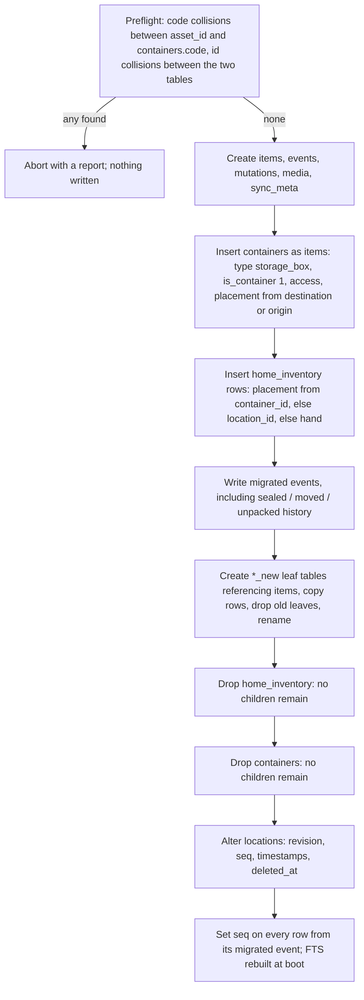
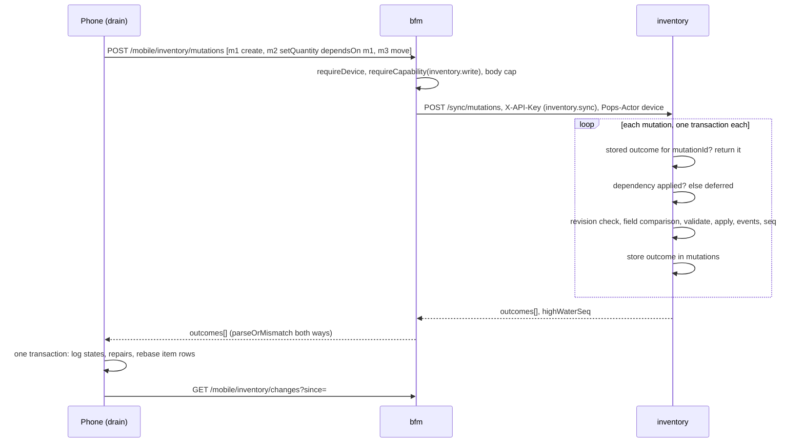
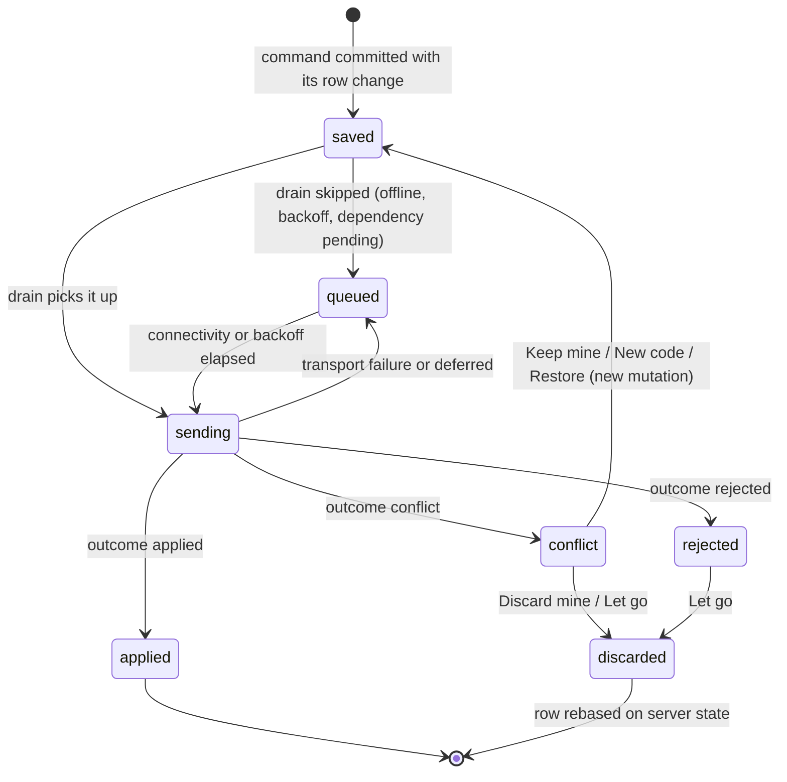

# Inventory ADR-002: One item identity, an event log, and a replicated catalogue on the phone

## Status

Accepted, 2026-09-18. The owner delegated these technical calls to this design, and implementation has started against it (Phase A slices are already landing). Technical design gate for the Inventory rebuild (POPS-3994). Builds on inventory [ADR-001](./adr-001-domain-vocabulary.md) (domain vocabulary) for every noun used here, on root [ADR-044](../../../../docs/architecture/adr-044-inbound-service-account-scope-enforcement.md) and [ADR-048](../../../../docs/architecture/adr-048-mobile-capability-scopes.md) for authorisation, and on [ADR-033](../../../../docs/architecture/adr-033-cross-language-pillar-contracts.md) for the Swift contract boundary. The bfm and iOS parts are recorded here rather than in a root ADR because every one of them exists to serve this pillar's protocol; a second consumer of the sync machinery would be the moment to lift them.

## Context

The product source of truth ("Inventory product and design source of truth", Huly, POPS Product Design) and ADR-001 settle what Inventory is. Every iOS screen family is approved (2026-09-18). What they deliberately leave open is the list this document answers: physical schema, migration from the separate container table, the revision and conflict protocol, offline code allocation, the phone's local database and media eviction, the mutation log and replay order, the bfm wire contract and its compatibility rules, search, authorisation and rollout.

What the code holds today (`origin/main`, 2026-09-18):

- `pillars/inventory` is Express 5 plus ts-rest over one SQLite file, Drizzle migrations applied at boot inside one transaction, behind `withPreMigrationBackup`. Tables: `home_inventory` (Notion-era columns, `asset_id` unique, `source_ref` unique, `container_id`), `locations` (self-referential, no FK on `parent_id`), `containers` (POPS-3581: `state` in `open|sealed|moved|unpacked`, origin and destination locations), and five leaf tables (`item_photos`, `item_uploaded_files`, `item_documents`, `item_connections`, `item_fixture_connections`) that cascade from `home_inventory`.
- No quantity, no lifecycle, no history, no revisions, no soft delete. Offset pagination on `/items`.
- No inbound credential check: ADR-044 names inventory as one of the producers that still serves any in-network caller. `purchases` already calls `items.create` and `items.get` with an `inventory.items` scope; the MCP server calls items, locations, connections and fixtures with the `pops_api_key` account, whose grant is not visible from the repo.
- bfm has no inventory route, capability or scope, and no mobile route that batches, carries a revision, or supports offline replay. The only idempotency precedent is the receipt draft's `idempotencyKey`, and content addressing for receipt bytes.
- The iOS app has no local persistence of any kind and no deep-link handling. The approved Inventory design lives entirely in `DesignPlayground` (about 16,000 lines across `Surfaces/Inventory` and `Components/Inventory`) with no `AppCore` domain types and no `FeatureInventory` package.
- Production holds zero items and zero locations (read through the MCP inventory tools on 2026-09-18). The migration below must still be correct on any database, but its live blast radius today is nil.
- The platform's soft-URI grammar is `pops://<pillar>/<type>/<id>` with a singular type (`libs/sdk/src/soft-uri.ts`), and `purchases` already stores `pops://inventory/item/<id>` in `purchase_item_units.inventory_item_uri`.

The move-out deadline is about 2026-10-12. The product says the phone must work offline after one synchronisation; the approved screens draw every sync and repair state.

## Decisions

Each decision lists what was rejected and what it costs. Where the direction handed to this design was wrong on the evidence, the decision says so and records what replaced it.

### D1. One identity: containers fold into items

| Option                                                            | Pros                                                                                                                            | Cons                                                                                                                                  |
| ----------------------------------------------------------------- | ------------------------------------------------------------------------------------------------------------------------------- | ------------------------------------------------------------------------------------------------------------------------------------- |
| **A container is an item whose type grants containment (chosen)** | One id, one QR, one lifecycle, one history, one placement column set; "box inside a box" is ordinary recursion; matches ADR-001 | Every item row carries container-only columns (`access`, `is_full`) that are null for most rows                                       |
| Keep `containers` and add a `kind` bridge                         | No migration of the existing table                                                                                              | Two identities for one physical thing; every action (discard, photograph, label, move) implemented twice; ADR-001 already rejected it |
| Containment as a type field in `fields`                           | Nothing new on the row                                                                                                          | A capability changes which screens exist, which ADR-001 says a field must never do; the database could not constrain access state     |

**Decision.** `containers` is removed. A container is an `items` row with `is_container = 1`. `is_container` is not writable by a client: the server sets it from the item's persisted type, whose catalogue definition declares the `containment` capability. An untyped item is never a container (ADR-001: a capability is something a type grants). Access state is `open | closed` on the row. `sealed`, `moved` and `unpacked` are not states: they become history events (D4). Fullness is `is_full`, a manual yes/no owned by the containment capability rather than by any type's field list, because the approved container page shows it for every container and furniture types would otherwise each redeclare it.

**Consequences.** A type change that would remove containment from an item that still holds active contents is rejected (`has_contents`). The playground's `InventoryAccess.sealed` case has no backend counterpart and is dropped when the vocabulary moves into `AppCore`. Migrated boxes need a type: they receive `storage_box` (the playground's "Storage box" template), which is the only way an existing box stays a container under this rule.

### D2. Placement is one of three, stored explicitly, with one remembered previous placement

| Option                                                                              | Pros                                                                                                | Cons                                                                                                                  |
| ----------------------------------------------------------------------------------- | --------------------------------------------------------------------------------------------------- | --------------------------------------------------------------------------------------------------------------------- |
| **`placement_kind` plus the matching reference, enforced by CHECK (chosen)**        | Illegal combinations cannot be written; in hand is a state, not an absence; one row change per move | Three columns where one would do for a pure tree                                                                      |
| Nullable `location_id` and `containing_item_id`, meaning inferred from which is set | What the table has today                                                                            | "Both set" is today's actual state after `moveContainer`, and "neither set" cannot distinguish in hand from forgotten |
| A separate `placements` history table as source of truth                            | History for free                                                                                    | Every read becomes "latest row per item"; the event log (D4) already records history                                  |

**Decision.** `placement_kind in ('location','container','hand')`. `location` requires `location_id` and forbids `containing_item_id`; `container` the reverse; `hand` forbids both. In hand remembers `previous_placement_kind` plus one of `previous_location_id` / `previous_containing_item_id`, with no foreign key, because "Previous place deleted" is an approved state and the reference must survive the target's tombstone. Effective location is derived by walking `containing_item_id` upward (a recursive CTE server-side, the same walk on the phone) and is never stored, so moving a container writes one row: its contents are contained, not relocated, and their revisions do not move. That is what keeps a box move from raising a conflict on every item inside it.

Containment cycles are rejected: before a move into container `C`, the server walks `C`'s ancestors and refuses (`cycle`) if the moving item is among them, or if the chain exceeds 32 levels. A container may not contain itself (CHECK).

Deleting a location (the approved "Deleting a place with things in it" state) is a tombstone plus reparenting: child places and direct items move to the parent place; at a root they go in hand with the deleted place as their previous placement, which is exactly what produces the approved "Previous place deleted" row.

**Consequences.** Every query that shows "where" joins through the walk. The data is thousands of rows, not millions, so the CTE is cheap; if it ever is not, an `effective_location_id` cache can be added without changing the protocol, because it would not be revisioned.

### D3. Lifecycle and quantity are columns; the reason lives on the event

**Decision.** `lifecycle in ('active','retired','discarded','lost','destroyed')`, independent of placement. The reason (donated, sold, used up, broken, gave away) is stored only on the lifecycle event, per POPS-3989. `destroyed` is terminal: `restore` from it is rejected (`illegal_transition`), matching `InventoryLifecycle.isRestorable`. An inactive item keeps its placement for history, and is excluded from contents lists, counts and search unless "Include inactive" is on.

Quantity is an integer on the row, `CHECK (quantity >= 1)`. `split` creates a new item with a client-minted id, the split-off count and the same placement, type, fields, note and photo references; the code is not copied (a code is one sticker). There is no partial discard: a group is discarded whole, split first, or renumbered.

| Option                                             | Pros                                                                                              | Cons                                                                                                                                                                 |
| -------------------------------------------------- | ------------------------------------------------------------------------------------------------- | -------------------------------------------------------------------------------------------------------------------------------------------------------------------- |
| **Lifecycle column, reason on the event (chosen)** | Badge is the lifecycle word; filters are a column predicate; reason cannot drift from its history | Reason is not queryable without reading events                                                                                                                       |
| Lifecycle as a derived value over events           | One source of truth                                                                               | Every list and count replays events                                                                                                                                  |
| `quantity >= 0`, keeping "none left" rows          | The playground's `InventoryQuantity.badge` and filter draw "None left"                            | No approved action produces zero (Change quantity is `1...9999`, Split leaves at least one, discard is whole); a zero row is a used-up item wearing the active badge |

**Consequences.** The playground's "None left" badge and "None left" quantity filter can never match a real row. That is a product-visible gap and is listed under open questions rather than silently settled.

**Grouped quantity and containment are mutually exclusive (added 2026-09-24, POPS-4354).** A container is one physical thing (D1); "3 boxes" holding the same contents is incoherent. `is_container = 1` therefore implies `quantity = 1`, both ways: `item.create` and `item.changeType` reject a containment-capable type paired with `quantity > 1` (`quantity_container_conflict`), and `item.setQuantity` rejects raising a container's own quantity above 1 the same way. Because a container's quantity can never exceed 1, `item.move`'s `store`/`move` verbs also refuse a target whose quantity is greater than 1 (`quantity_container_conflict`, checked directly rather than relied on as a corollary of `not_container`, as a defence against a row that reached that state some other way). A published catalogue change that grants containment to a type is already `migration_required` (`type_capabilities_changed`); the migration is refused (`409 migration_containment_quantity_conflict`, with an affected count) rather than silently run when any live item of that type carries `quantity > 1`, because no migration step in D5's closed vocabulary can decide how to split an arbitrary group — that is an owner decision (`item.split`), not a mechanical rewrite.

### D4. History is an append-only event log, and its sequence is the sync sequence

| Option                                                                             | Pros                                                                                                                                                                                                    | Cons                                                                         |
| ---------------------------------------------------------------------------------- | ------------------------------------------------------------------------------------------------------------------------------------------------------------------------------------------------------- | ---------------------------------------------------------------------------- |
| **One `events` table; `seq` autoincrement is the global change sequence (chosen)** | History, change feed and conflict detection share one ordered record; undo is an ordinary event; SQLite serialises writers, so a committed `seq` N implies every `seq` below N is committed and visible | Every write path must go through the command layer (D6) or history has holes |
| Per-table `updated_at` for the feed, separate history table                        | Familiar                                                                                                                                                                                                | Clocks are not authority (product decision); two records to keep in step     |
| Trigger-written audit rows                                                         | Cannot be bypassed                                                                                                                                                                                      | Triggers cannot know the actor, the mutation id or the reason                |

**Decision.** `events.seq INTEGER PRIMARY KEY AUTOINCREMENT` is the server change sequence. Each event records the entity, the event kind, the fields it touched with before and after values, the reason, the entity revision after it, the actor (`device` with bfm's device id and label, `web`, `service` with the account name, or `migration`), the mutation id, and `compensates_seq` for an undo. Every revisioned row carries `seq` = the `seq` of the last event that changed it, or that re-sent it because its computed values read an item that event changed or a publication changed its evaluation (D5). Triggers make `events` append-only (`BEFORE UPDATE` and `BEFORE DELETE` raise).

Undo is a compensating event. `event.revert` inverts one event's field changes; it conflicts if any of those fields changed since. The phone's Undo capsule cancels the mutation if it has not left the device, and sends `event.revert` if it has.

**Consequences.** The log grows forever; at one household's volume that is megabytes. A database restored from backup rewinds `seq`; D10 handles that with an epoch.

### D5. Types are persisted, revisioned owner-authored data

The code-defined catalogue delivered the first six types, but it makes every correction a deploy. That contradicts the product's first real entry session, where a missing type and incomplete fields were ordinary owner decisions. The earlier D5 decision is replaced in full.

| Option                                                                                                  | Pros                                                                                                                     | Cons                                                                                                                        |
| ------------------------------------------------------------------------------------------------------- | ------------------------------------------------------------------------------------------------------------------------ | --------------------------------------------------------------------------------------------------------------------------- |
| Types remain TypeScript declarations projected to JSON                                                  | The current validators and snapshot guard remain simple                                                                  | Every type edit needs code review, the merge queue and deployment; an owner cannot complete the advertised workflow         |
| Store mutable current definitions only                                                                  | Small schema and simple reads                                                                                            | No atomic multi-row publication, no reproducible validation of an old offline write, and no trustworthy audit history       |
| Let every client interpret arbitrary JSON Schema or executable expressions                              | Familiar authoring vocabulary and nominal flexibility                                                                    | An installed phone cannot safely execute an open language; compatibility, traversal and resource limits become unknowable   |
| **Immutable published catalogue snapshots, edited through a persisted draft and a closed DSL (chosen)** | Owner-authored without deploys; every item and mutation names the schema that governed it; old replicas remain auditable | Full snapshots duplicate small definition rows, and all clients must implement the closed value and expression vocabularies |

#### Identity, drafts and publication

Types, fields and enum options each receive a server-minted UUIDv4 `id`. The id is the identity used by values, references and expressions and never changes. Each also has an immutable, case-insensitively unique `key` for MCP, imports and readable diagnostics. `label`, help text, order and presentation hints are mutable and are never identity. Renaming "Storage box" therefore changes only its label; renaming a field or enum option cannot orphan a value.

After first publication, a type's id/key, a field's id/key/kind/cardinality/storage mode/fixed unit/reference constraint, and an option's id/key are immutable across revisions. Type capabilities may change only through a migration because they materialise core columns such as `is_container`. Labels, help, order, presentation hints and legacy labels may change in a later snapshot; `required`, expressions and archive state follow the compatibility rules below.

A catalogue revision is a complete immutable snapshot. The server exposes one published revision and at most one editable draft based on it. Creating a draft copies the published definition rows under a new revision id. Every draft mutation carries `baseRevision`; a stale base is `409 catalogue_conflict`. It also carries `expectedDraftVersion`, the draft's `revision.draftVersion` as the caller last read it: the version advances on every successful patch, publication and abandonment by a compare-and-swap inside the mutation's own transaction, and a stale version is `409 catalogue_draft_conflict` with `currentDraftVersion`, changing nothing (POPS-4406). Publication runs in one `BEGIN IMMEDIATE` transaction:

1. verify that the draft still names the current published revision;
2. type-check every definition and computed expression, build the dependency graph and reject cycles or resource-limit violations;
3. compare the draft with its base and classify every change;
4. run any required explicit value migration and validate every affected item against the draft;
5. mark the revision published, stamp actor/time/note, update `sync_meta.catalogue_revision`, append catalogue audit events, and commit.

Clients therefore see either the previous snapshot or the complete new snapshot. Published definition rows and audit events are never updated or deleted. Abandoning a draft records `abandoned_at`; it does not erase the attempt. The response ETag is `"catalogue-<revision>"`; the integer revision, rather than a hash of mutable JSON ordering, is the sync authority.

The owner-facing REST surface is command-shaped so MCP and the web editor use the same atomic boundary:

| Route                                           | Body / result                                                                                            |
| ----------------------------------------------- | -------------------------------------------------------------------------------------------------------- |
| `GET /type-catalogue?revision=`                 | current or exact immutable descriptor; `404 catalogue_revision_unknown`                                  |
| `GET /type-catalogue/types/:typeId?revision=`   | one type as the current or exact published revision defined it; `404 catalogue_type_unknown`             |
| `GET /type-catalogue/audit?before=&limit=`      | reverse-chronological publication and abandonment events                                                 |
| `POST /type-catalogue/drafts`                   | `{ baseRevision }` → the new draft; conflicts if one already exists                                      |
| `PATCH /type-catalogue/drafts/:revision`        | `{ baseRevision, expectedDraftVersion, operations[] }` → the validated draft and a compatibility preview |
| `POST /type-catalogue/drafts/:revision/publish` | `{ baseRevision, expectedDraftVersion, note, migrationName? }` → the published descriptor                |
| `POST /type-catalogue/drafts/:revision/abandon` | `{ baseRevision, expectedDraftVersion }` → the abandoned revision                                        |

Draft operations are `put_type`, `put_field`, `put_enum_option`, `archive_type`, `archive_field`, `archive_enum_option` and `reorder`; `archive_type` and `archive_field` take an optional `replacedBy` (see Archive and compatibility rules). A `put` creates when `id` is absent (the server returns its id) and updates mutable attributes when `id` is present; it cannot replace immutable attributes. Every response returns structured validation errors with the definition id, JSON path and code. Reads require `inventory.types.read`; all draft and publication commands require either a verified owner web session or a service account with `inventory.types.manage`. Bare in-network browser traffic is `401` on this sub-router even while D12 keeps `requireCredential: false` for the pillar's existing routes. bfm receives only the immutable read route and never the authoring surface.

#### Field vocabulary and representations

A field declares `kind`, `cardinality: 'one' | 'many'`, `required`, and either `storage: 'stored'` or a computed definition. `many` is valid for every kind except `boolean`; it is an ordered list, not a recursive value kind. A required `one` field needs one value and a required `many` field needs at least one. Optional absence is represented by no value rows and by omission on the wire; `null`, empty strings and empty `many` arrays are not stored values. Duplicate values are allowed because order and repetition can be meaningful.

The closed primitive vocabulary and its canonical forms are:

| Kind          | Wire value                                                                                     | Canonical SQLite `value_json`                                                                                                           |
| ------------- | ---------------------------------------------------------------------------------------------- | --------------------------------------------------------------------------------------------------------------------------------------- |
| `short_text`  | JSON string, 1..200 Unicode scalar values                                                      | the same JSON string                                                                                                                    |
| `long_text`   | JSON string, 1..20,000 Unicode scalar values                                                   | the same JSON string                                                                                                                    |
| `integer`     | JSON integer in `[-9007199254740991, 9007199254740991]`                                        | canonical base-10 JSON number, no exponent                                                                                              |
| `decimal`     | decimal string such as `"12.340"`                                                              | the same string; grammar `^(?!-0(?:\\.0+)?$)-?(?:0\|[1-9][0-9]*)(?:\\.[0-9]+)?$`, at most 18 significant digits and 9 fractional digits |
| `boolean`     | JSON boolean                                                                                   | `true` or `false`                                                                                                                       |
| `enum`        | `{ "optionId": "<uuid>" }`                                                                     | the same object; labels and keys are resolved from the named catalogue revision                                                         |
| `measurement` | `{ "amount": "12.500", "unit": "kg" }`                                                         | the same object; `amount` follows `decimal`, and `unit` must equal the field's immutable fixed unit                                     |
| `date`        | `YYYY-MM-DD`                                                                                   | the same string, Gregorian and calendar-valid                                                                                           |
| `date_time`   | RFC 3339 UTC with exactly milliseconds, for example `2026-09-22T04:05:06.123Z`                 | the same string                                                                                                                         |
| `url`         | absolute `https` URL string                                                                    | the same string after URL parsing and canonical percent-encoding; fragments are allowed                                                 |
| `reference`   | write: `{ "targetKind": "item" \| "location", "targetId": "<uuid>" }`; read adds `targetState` | identity object only; no SQLite FK, so a tombstoned or not-yet-replicated target remains representable                                  |

Decimal scale is data: `12.340` remains `12.340`; clients never parse it through binary floating point. Leading zeroes, a leading plus, exponent notation and negative zero are rejected. Addition and subtraction retain the greater operand scale, multiplication uses the sum of operand scales, and division must terminate within nine fractional digits. A result beyond either bound is `precision_overflow`; no layer rounds silently.

A measurement field fixes both dimension and unit at definition time. A value never chooses a convertible display unit, so equality, offline validation and decimal precision do not depend on floating-point conversion. A later UI may display a converted amount, but it writes the fixed unit. Only a version-2 expression converts between units (below), and its result is written in the computed field's fixed unit. Changing kind, cardinality, fixed unit, reference target constraint, or stored/computed mode is not an in-place edit: publish a replacement field with a new id and migrate explicitly.

A reference definition fixes `targetKind` and, for item references, may close the target to a set of type ids. A new or edited value must resolve to a live target satisfying that constraint or is rejected as `target_missing` or `reference_type_mismatch`. Deleting a target never cascades into field values: reads add `targetState: 'resolved' | 'deleted' | 'missing' | 'unresolved'`, where `unresolved` is used only while a replica snapshot is incomplete. A complete replica with no row is `missing`; a tombstone is `deleted`. Changing an item's type is rejected when it would invalidate a live incoming constrained reference unless the catalogue publication runs an explicit reference migration. Computed traversal accepts only `resolved`; every other state is unavailable.

The wire carries item values as ordered entries rather than an object keyed by mutable names:

```json
{
  "fieldId": "a358b125-cb0c-4e74-9449-f6f8fcc9f45f",
  "state": "value",
  "values": ["fragile", "garage"],
  "provenance": { "source": "stored", "catalogueRevision": 12 }
}
```

For `one`, `values` has exactly one element; for `many`, it has one or more. SQLite stores one `item_field_values` row per element with zero-based `ordinal`. The command layer parses `value_json`, validates it against the exact published definition, then writes its canonical encoding. SQLite's JSON checks protect shape at rest; application validation owns kind-specific rules.

#### Archive and compatibility rules

Anything with historical use is archived, never deleted. An archived type cannot be assigned to another item, but existing items remain readable and editable. An archived field remains in descriptors and values remain readable, but forms do not offer it for new data. An archived enum option remains valid wherever already selected and is not offered for new selection. Unused draft-only definitions may be removed before publication. A published id or key is never reused.

Archiving a type or field may record its replacement (`replacedBy`, stored as `replaced_by` on the definition row and projected on every descriptor and the phone catalogue). A new replacement must be a live definition of the same kind in the draft, with no cycle; a replacement field belongs to the same type, or to the type that replaces that type. Recorded lineage never changes and keeps its definition archived. A migration `copy` step does not imply lineage: it can fan one field out to several, and the owner says which one takes over. When a change authored against an older revision is rebased, a value on a field archived since moves onto the live end of its lineage when that field has the same shape (`sameFieldShape`: kind, cardinality, storage, fixed unit, reference constraint) and the change does not already write it; a clear never moves. A named type moves onto its replacement only when every value lands on a stored live field of it. The server (`moveOntoReplacements`) and the phone (`CatalogueReplacement`) apply the same rule; whatever does not move is refused as `catalogue_repair_required` with a `replaced` change naming the replacement (owner repair decision 3, POPS-4494).

Publication classifies changes as follows:

- Compatible without value migration: labels, help, order and presentation hints; adding a type whose fields use only primitive kinds the base already uses; adding an optional stored field; adding an enum option; relaxing `required`; archiving a definition while retaining its existing values as readable history; and, because computed values are derived, adding a computed field, changing an expression, enabling overrides, or disabling overrides no live item holds.
- Compatible for data but protocol-gated: adding a primitive kind, cardinality rule, reference target kind or provenance case that an installed client may not understand. An expression node is not gated: phones carry expressions as opaque JSON and a client that cannot parse one keeps the server's evaluation (D11), so a new node degrades to "Out of date" after a local edit rather than failing. A change to what existing nodes mean is not a new node, because a phone that parses it would evaluate it wrongly: it takes a new `expressionVersion`, which such a phone refuses to parse and so defers to the server the same way. Version 2 (dimensional units) is gated that way. Publication raises the revision's `minimumProtocol` to the first protocol that understands it (protocol 2 for every primitive kind) and answers `409 protocol_rollout_required` until `sync_meta.min_protocol` reaches it (D10).
- Requires an explicit migration: making a field required, removing or remapping values instead of merely archiving their definition, narrowing reference targets, disabling overrides that live items hold (a `drop_value` step on the field discards them; the preview's `discardedOverrides` counts the items), or replacing any immutable field characteristic.
- Forbidden: mutating or reusing an id/key, editing a published snapshot, publishing values that fail the candidate schema, or deleting audit history.

A migration is a named, version-controlled server operation from one catalogue revision to the next. It declares affected type and field ids, supports only `copy`, `set_default`, `map_enum`, `convert_decimal`, `replace_reference` and `drop_value` steps, and is dry-run against all affected rows before publication. It executes in the publication transaction, appends one ordinary item event per changed item with actor `migration`, and records counts plus the migration name on the catalogue audit event. Arbitrary SQL, JavaScript and best-effort partial rewrites are rejected. `drop_value` must be named explicitly; archive is not a euphemism for data loss.

#### Computed fields and overrides

A computed field has `expressionVersion` 1 or 2, a typed expression AST, and `allowOverride`. Both versions share one grammar, permit only `one` cardinality and accept these exact JSON node forms:

```text
{ "op": "literal", "value": <primitive wire value> }
{ "op": "read", "path": ["<reference-field-id>"], "fieldId": "<field-id>" }
{ "op": "negate" | "not", "value": <expression> }
{ "op": "add" | "subtract" | "multiply" | "divide" | "concat" |
        "equal" | "less_than" | "and" | "or",
  "left": <expression>, "right": <expression> }
{ "op": "coalesce", "values": [<expression>, <expression>, ...] }
{ "op": "if", "condition": <expression>,
  "then": <expression>, "else": <expression> }
```

`number` means integer, decimal, or a measurement in one fixed unit. `add` and `subtract` require identical numeric kinds (and identical measurement units). `multiply` and `divide` accept integer with integer, decimal with decimal, or measurement with decimal; their result is respectively integer, decimal or the measurement kind. Integer division must be exact. There are no implicit integer/decimal conversions, and in version 1 no unit conversions. Integer overflow, decimal precision overflow and division by zero are evaluation errors. `and`, `or` and `if` short-circuit left-to-right. `coalesce` takes two or more values of one type and returns the first that is available; it is the only node that skips an unavailable argument (an evaluation error still stops it). When every argument is unavailable it reports the last one's reason and failing field, and `missingInputs` names every argument's missing inputs. Its dependencies include every argument evaluated and, for each skipped one, the input it lacked (at revision 0 when that item is absent), so a fallback goes stale when the input appears. Literals use the primitive wire forms above. No node reads time, network, user identity, SQL or arbitrary code.

Version 2 changes how measurements combine (`measurement-units.ts`, mirrored in the phone's AppCore) and how `equal` compares decimals:

- **Units.** A fixed unit is a symbol or a derived unit term: symbols joined by `·` with superscript powers 2 to 99, then optionally `/` and a denominator (`cm²`, `kg/m³`, `1/s`), each symbol once. The known symbols (the persisted-catalogue units: `mm`, `cm`, `m`, `kg`, `L` as length³, `W`, `V`, `Gbps`, `lm`, `K`) each convert into their dimension's coherent unit by a power of ten. Any other symbol is its own dimension. Text outside the grammar (`fl oz`) stays a valid unit that equals only itself and cannot be multiplied or divided.
- **Add, subtract, compare.** Both sides must have the same dimension. The right side is converted into the left side's unit. `equal` on two measurements compares the converted amounts numerically.
- **Decimals.** `equal` on two plain decimals compares their values exactly at any scale, so `1.5 × 2 = 3` and `1.50 = 1.5` hold; version 1 compares their spelling. A decimal and text share a wire form, so the operands take the left operand's validated type: a read has its field's kind, a literal the kind its spelling gives it, arithmetic is numeric, and `if` and `coalesce` take their first branch's. Text still compares by identity. `less_than` compares decimals by value in both versions.
- **Multiply, divide.** Two measurements give a derived unit. Each right symbol merges into the same left symbol, or else into the first left symbol of the same known dimension (the right amount is converted), or else is appended. `cm × cm` is `cm²` and `cm² × mm` is `cm³`. A result whose dimension cancels is a plain decimal in coherent units: `cm ÷ mm` is `10` and `L ÷ cm³` is `1000`. A measurement times or divided by a decimal keeps its unit.
- **Result.** Publication requires the expression's dimension to equal the dimension of the field's fixed unit. Width × Height × Depth in cm, cm and mm can fill a Volume declared in `L`, `cm³` or `mm³`, but not one declared in `cm²`. Evaluation converts the result into the fixed unit.
- **Exactness.** Every conversion only moves the decimal point, and each step keeps the decimal bounds (9 places, 18 significant digits). A step that exceeds them is `precision_overflow`. This includes converting the right operand before a multiply and converting the final result: `0.0000001 mm` in a `m` field overflows, and `0 mm` is `0.000 m`.

A saved version-1 field stays version 1 unless an edit needs unit conversion or a derived unit, which only version 2 validates; the web builder then says so before saving. Moving it silently would change what its `equal` computes and stop phones from before version 2 evaluating it. New fields are version 2. Every other version-1 vector evaluates identically under version 2, and a test pins the exceptions.

`read` with an empty path reads another field on the same item. Each path element must name a `one` item-reference field, and publication resolves the next field against every allowed target type. A path may traverse at most two references; an AST may contain at most 128 nodes and 32 distinct dependencies. The publication graph uses `(typeId, fieldId)` nodes and includes all possible target types for reference reads. Any direct or transitive cycle rejects the whole publication, including a cycle that only appears through references.

Evaluation has three results:

- `value`: a canonical value of the computed field's declared kind;
- `unavailable`: a required read is absent, a reference is absent/unresolved/tombstoned, or a dependency is itself unavailable;
- `error`: corrupt persisted input, overflow, precision loss or division by zero.

Absent values are exposed as `unavailable`, not as a magic zero, empty string or false. The wire reasons are `missing_dependency`, `reference_unresolved`, `reference_missing`, `reference_deleted` and `evaluation_error`, with the failing field id and traversed item ids. `missingInputs` lists every input without a value as `{ reason, fieldId, itemId }` (the field, and the item the read had reached). A single read gives one entry. An all-unavailable `coalesce` gives each argument's entries in order, each item and field once. `evaluation_error` gives none. `failedFieldId` stays one of them, so clients that predate the list are unaffected. A dependency's unavailable reason propagates unchanged. Errors are logged with item, field and catalogue revision and are exposed as unavailable with reason `evaluation_error`; they do not fail the item response. Only the selected branch of `if`, and only the necessary side of a short-circuit boolean node, contributes a runtime missing dependency. Evaluation is deterministic against one item-read snapshot and the catalogue revision pinned by that response.

When `allowOverride` is false, an explicit value for the computed field is invalid. When true, an override uses the same value grammar and cardinality as the computed result and wins without evaluating dependencies. Clearing an override deletes its value rows and immediately resumes evaluation; it does not copy the last computed value. An item's `fieldValues` carry only stored values and overrides; `computedValues` carries one entry per computed field of its type. `state` is closed; `reason` is an open string:

```json
{ "fieldId": "<uuid>", "source": "computed", "catalogueRevision": 12, "state": "ok", "values": ["48.000"],
  "dependencies": [{ "itemId": "<uuid>", "fieldId": "<uuid>", "revision": 7 }], "traversedItemIds": ["<uuid>"] }
{ "fieldId": "<uuid>", "source": "computed", "catalogueRevision": 12, "state": "overridden", "values": ["50.000"],
  "override": { "catalogueRevision": 11 }, "dependencies": [], "traversedItemIds": [] }
{ "fieldId": "<uuid>", "source": "computed", "catalogueRevision": 12, "state": "unavailable",
  "reason": "missing_dependency", "failedFieldId": "<uuid>",
  "missingInputs": [{ "reason": "missing_dependency", "fieldId": "<uuid>", "itemId": "<uuid>" }],
  "dependencies": [], "traversedItemIds": ["<uuid>"] }
```

Computed results are not stored as authority. The server and replica may cache them by `(item revision, catalogue revision, dependency revisions)` and must discard the cache when any key changes. The item event log records setting and clearing overrides; ordinary dependency changes are already visible through their own item events.

A dependency change on another item must still reach replicas holding the dependent's evaluation. `item_computed_dependencies` indexes, per dependent item, every other item its computed values read or reached (a deleted or missing reference target included). Each applied mutation, in its own transaction, refreshes the index rows of the items it changed, then re-sends every live dependent of those items: the dependent's index rows are refreshed and its `seq` is set to the mutation's last event `seq`, with no event and no revision change, so the change feed carries it beside the change with a fresh evaluation. A replica therefore accepts an item row at its stored revision when the `seq` is newer. At most 256 dependents are re-sent per mutation, lowest ids first; any beyond that keep their evaluation until they next change, which a replica shows as out of date. Publication rebuilds the whole index, and boot rebuilds it when it was built for another catalogue revision.

A publication changes evaluations without writing the items: a computed field added, archived or restored, its expression replaced or its override policy changed, or a migration that rewrites values other items read. Both sides act on it. The server, in the publication's transaction and after the index rebuild, re-sends every live item of a type whose computed definitions changed, plus up to 256 index dependents (lowest ids first) of those items and of the items the migration wrote. Unlike the mutation path, each re-sent item gets its own `recomputed` event (no fields, its current revision, actor `migration`, not revertible) and its `seq` moves to it: a publication without a migration appends no other event, and the feed only advances past a `seq` an event holds. An item the migration wrote already carries its `migrated` event and is not re-sent again. The search index is rebuilt in the same transaction. The dependency index is per item, not per field, so a dependent is re-sent even when it reads a field the publication did not change. The phone, independently, treats a server evaluation made against an older catalogue revision than its active one as no longer current: when its active revision moves it re-evaluates every item holding an evaluation or of a type with a computed field, and shows the value as out of date where it cannot evaluate. That covers dependents beyond the cap and any publication the server did not re-send.

#### Contract examples

The following examples are normative abbreviations of the shapes above:

- Scalar: `{ fieldId: voltage, state: 'value', values: ['12.000'], provenance: { source: 'stored', catalogueRevision: 12 } }` for a decimal field.
- Multi-value: `{ fieldId: protocols, state: 'value', values: [{ optionId: usbC }, { optionId: thunderbolt4 }], ... }`; order is retained.
- Reference: `{ fieldId: storedWith, state: 'value', values: [{ targetKind: 'item', targetId: boxId, targetState: 'deleted' }], ... }`; the deleted target leaves its id present.
- Computed: `multiply(read([], packageCount), read([], unitPrice))` over two decimal fields produces `state: 'ok'`, `48.000` and dependency revisions.
- Overridden: the same field with explicit override `50.000` returns `state: 'overridden'`, `50.000`, even when `unitPrice` is absent.
- Cleared override: deleting that override causes the next read to evaluate again and return `state: 'ok'`, `48.000`.
- Unavailable: after clearing the override and removing `unitPrice`, the field returns `state: 'unavailable', reason: 'missing_dependency'`; it does not return null or the old override.

**Consequences.** A new type, field, option or compatible label correction needs no deployment. A new primitive still needs an app release and protocol rollout; a new expression node needs an app release for phones to evaluate it, but no protocol rollout. The seven former code definitions were bootstrap input for migration `0017_persisted_item_types` only; after publication the database is the authority and the code templates are removed. The "type arrived" sheet triggers on a published catalogue revision that adds an active type whose `legacyLabels` match `items.legacy_type`.

### D6. Every write is a command; the command layer is the only writer

**Decision.** `pillars/inventory/src/domain/commands/` implements every mutation as a command: validate, check revision (D8), apply, write events, bump revision and `seq`, maintain the search index, all in one transaction. The sync endpoint, the rewritten legacy REST routes (`POST /items` for purchases, `GET/PATCH /items/:id`, location CRUD for MCP and the web) and the web's future edits all call it. The `/containers*` routes are deleted: their only consumer is the web app's generated client, with no page using it.

Clients mint ids (UUIDv4, validated) for items, locations and mutations. An offline create therefore has its final id from the first keystroke (the playground's `InventoryDraft.internalID` already assumes this), no id mapping exists anywhere, and a label printed later from web encodes the same id the phone created.

**Consequences.** Hard deletion leaves the everyday path. Delete becomes a tombstone (`deleted_at`) that `item.restoreDeleted` reverses, which is what makes the approved "Deleted on iPad, Restore" repair possible. A purge of tombstones is an operator action, not built here.

### D7. Codes are optional, unique when present, and never changed by the server

**Decision.** `items.code` is nullable (ADR-001: most items carry none) with a unique index on `code COLLATE NOCASE`. The migration moves `home_inventory.asset_id` and `containers.code` into it. A new item's code travels inside `item.create { item, code }`, and a later change of code is `item.setCode`. Both check the code the same way, so a create naming a held code is refused whole rather than leaving an item without the code it was made for (POPS-4063); offline, the collision found at sync opens the code repair, whose new code re-sends the create. On collision the outcome is `conflict` of kind `code_collision` carrying the holder's name and a suggestion (the next free code keeping the stem, `B412` to `B413`). The server never assigns or rewrites a code on its own, because the label may already be printed.

`POST /codes/suggest` returns suggestions online: deterministic stem plus next free number in Phase A, an AI ranking behind the same route in Phase C. Offline, the approved `.offline` assist state applies and a typed code is checked against the local replica only.

### D8. Revisions and conflicts are per row, resolved per field against the event log

| Option                                                                                             | Pros                                                                                                             | Cons                                                                                                                                           |
| -------------------------------------------------------------------------------------------------- | ---------------------------------------------------------------------------------------------------------------- | ---------------------------------------------------------------------------------------------------------------------------------------------- |
| Row-level optimistic concurrency, any mismatch is a conflict                                       | Simplest                                                                                                         | Renaming a box on the iPad would conflict with packing into it on the phone; the approved fixtures show auto-resolution ("Same count on both") |
| Last writer wins by device clock                                                                   | No repair UI                                                                                                     | Clocks drift; the product forbids it                                                                                                           |
| CRDTs per field                                                                                    | Automatic merges                                                                                                 | Placement and lifecycle are not mergeable values; a merged "moved to two places" is wrong                                                      |
| **Row revision checked, then field-level comparison over events since the base revision (chosen)** | Conflicts only where two sources changed the same field to different values; convergent edits resolve themselves | The server reads the item's events since `baseRevision` on every stale write                                                                   |

**Decision.** `items.revision` and `locations.revision` increment on every change. Every mutation carries `baseRevision` (null for a create). On mismatch the server collects the fields changed by events after `baseRevision`. If none overlap the mutation's fields, it applies. If they overlap and the resulting value equals the current value, it applies with `converged: true` (the approved "Same count on both" resolved entry). Otherwise it returns `conflict` of kind `field` with the field, this mutation's value, the current value, and the source and time of the change that won (`source` from the event actor: a device label such as "iPad", or "Server" for web and services). Placement counts as one field, so the approved "Moved on iPad too" is exactly this case.

A dynamic field id is one conflict unit: replacing, reordering or clearing any member of a `many` value overlaps another change to that field. Stored values and overrides use the same field id for conflict reporting. `item.changeType` overlaps the type and every dynamic field it replaces; a dependency change on another item does not revise the computed item's row; it only re-sends it (D5), so a base revision held for that item stays current.

"Keep mine" re-sends the change with `baseRevision` set to the conflict's `currentRevision`. "Discard mine" drops the mutation and rebases the phone's view. Client times travel as `clientTime` and are stored on events as audit evidence only.

### D9. The sync protocol: snapshot, change feed, batched idempotent mutations, content-addressed media

**Decision.** Inventory owns the protocol (`pillars/inventory/src/contract/rest-sync.ts`, sub-routers `sync` (snapshot, changes, mutations, item history), `media`, `types`, `codes`). bfm exposes it under `/mobile/inventory/*` with the capability gate, body caps and the device as actor. bfm validates both directions with `parseOrMismatch` and maps field names to the mobile contract; it adds no semantics, because revision checks and outcomes must be decided by the producer that enforces them.

- **Snapshot**: pages of items, locations and photo references at a high-water `seq` S and `catalogueRevision` C fixed by the first page. Rows changed while paging may arrive newer than S; that is safe because the phone upserts by revision and then reads the feed from S. The first page is not applied until catalogue C is locally present.
- **Change feed**: every row with `seq > since`, tombstones included, ordered by `seq`, plus events after `since` so recent history is readable offline. A page that advances the catalogue carries the complete new catalogue snapshot before rows validated by it. Older history is fetched per item on demand.
- **Mutations**: up to 50 per request, each with `mutationId`, `op`, `entityId`, `baseRevision`, `catalogueRevision`, `dependsOn`, `clientTime`. Each is processed in its own transaction, in array order, and its outcome is stored in `mutations` in the same transaction, so a retried batch replays stored outcomes and never applies twice. A mutation whose dependency is unknown to the server or did not apply returns `deferred` and stays queued. An older catalogue revision is validated against its exact authored snapshot, then against the active snapshot. A rename-only or otherwise compatible diff rebases and persists the active revision. A protocol-gated or migration-required diff returns `rejected: catalogue_update_required`; an archived or replaced stable definition that invalidates the authored values returns `rejected: catalogue_repair_required`. Neither path falls back to revision 1.
- **Media**: `PUT /media/:sha256` with the bytes; the server verifies the hash, stores `sha256[0:2]/sha256` under the images volume, and derives 256 px and 1024 px variants with `sharp`. Re-sending is naturally idempotent (the receipt-bytes precedent). `item.attachPhoto` references the hash and depends on nothing server-side; if the bytes are absent the outcome is `rejected: media_missing`, which the phone treats as "upload first, then retry".

Outcomes map one to one to the phone's states, with one addition the direction lacked: `deferred`, which is "Waiting to sync". `rejected` has no approved repair screen; see open questions.

### D10. Versioning and recovery

**Decision.** Every `/mobile/inventory/*` request carries `Pops-Inventory-Protocol: <n>`. The server answers `426 client_too_old` below its minimum, which the phone shows as the approved blocking "This app is too old". Additive fields do not bump the protocol. Server-to-client values that may grow (lifecycle, event kind, discard reason, repair kind) are declared as strings on the wire and decoded into Swift enums with an `.unrecognised(String)` case, as `PurchaseSettlement` does, because POPS-1663 and POPS-1992 both broke installed apps with a closed enum.

Protocol and catalogue revision are independent. A label edit increments only the catalogue revision; a new primitive, provenance case or other syntax an old binary cannot safely preserve requires a new protocol. An expression node is not such syntax (D5). The persisted value-entry and definition shapes in D5 begin at protocol 2. Publication may name a higher `minimumProtocol`, but it remains a draft until an iOS build supporting that protocol is available. Rollout order is inventory and bfm accepting the new protocol, iOS release, observed minimum supported build, an owner atomically raising `sync_meta.min_protocol` through `POST /type-catalogue/protocol-rollout`, then catalogue publication that uses the new vocabulary. The activation is a compare-and-swap against `expectedMinimumProtocol`, cannot exceed the server build's supported protocol and cannot decrease. Publication reads the same persisted value and refuses a catalogue minimum above it. Reversing that order strands installed offline replicas.

bfm passes the protocol header unchanged in both directions and never down-converts catalogue data. The server returns its current `minimumProtocol` and `catalogueRevision` on catalogue, snapshot and feed responses. An installed client that understands the protocol but lacks the named catalogue downloads that immutable snapshot before applying dependent rows. A client below the protocol minimum may keep showing its last local replica read-only, but it cannot refresh or enqueue writes.

`sync_meta.epoch` is a random id served with every snapshot and feed page. A `since` above the server's maximum `seq`, or an epoch the phone does not know, yields `409 resync_required`: the phone takes a fresh snapshot and keeps its mutation log, whose client-minted ids and base revisions make replay safe. The restore runbook rotates the epoch.

### D11. The phone keeps a GRDB replica and a durable, ordered mutation log

| Option                          | Pros                                                                                                                                                          | Cons                                                                                                                                                                          |
| ------------------------------- | ------------------------------------------------------------------------------------------------------------------------------------------------------------- | ----------------------------------------------------------------------------------------------------------------------------------------------------------------------------- |
| SwiftData                       | Native; no dependency                                                                                                                                         | No FTS5; migrations are implicit and hard to test; transaction boundaries across the replica and the log are not explicit; `@Model` classes leak persistence into view models |
| Plain SQLite C API              | No dependency                                                                                                                                                 | Hand-written binding, migration and observation code of the size GRDB already is                                                                                              |
| **GRDB, exact-pinned (chosen)** | Explicit transactions, `DatabaseMigrator`, FTS5, `ValueObservation` for SwiftUI, runs under `swift test` on the macOS host that `mise run test:packages` uses | A new external dependency on the `ModuleBoundaryTests` allowlist                                                                                                              |

**Decision.** A new implementation package `Packages/InventoryReplica` (AppCore plus GRDB) implements the `AppCore` `InventoryStore` protocol. It is added to `ModuleBoundaryTests.implementationPackages` and GRDB to `allowedExternalPackages` with an `exact:` pin. It performs no HTTP: it talks to an `InventorySyncTransport` protocol in `AppCore`, which `BFMClient` implements, so "exactly one package performs HTTP" still holds.

- **Durability before success.** A command commits the optimistic row change and its log entry in one GRDB transaction before the view reports success. The database runs WAL with `synchronous = FULL`; WAL's default `NORMAL` can lose the last transaction on power loss, which would break "restart must not lose staged work".
- **Data protection.** Database and media files use `FileProtectionType.completeUntilFirstUserAuthentication` so background refresh works after first unlock. The media cache directory is excluded from backup; the database is not, because it holds unsynced work.
- **Two row layers.** `item_base` is the last server state (with revision and `seq`); `item` is the optimistic view. A feed page updates `item_base`, then rebases each affected row by replaying its pending mutations over the new base. Commands are applied locally by a Swift reducer whose behaviour is pinned to the server's by shared test vectors (`pillars/inventory/contracts/command-vectors-v1.json`, generated by the TypeScript command tests and vendored to `clients/ios/Contracts`, with the same drift guard as the refresh-message vector).
- **Catalogue replicas.** Immutable catalogue revisions, definitions and enum options are persisted in GRDB, not flattened into Swift enums. Applying a catalogue and the first rows that name it is one transaction. Item values and queued mutations retain their catalogue revision; old revisions remain until no replica row or mutation references them. A publication leaves an unchanged item's values at the revision they were written under, and the server never relabels them to the active one, so a sync page can name revisions older than the one it pins: the phone fetches every revision the page's items name that it lacks, and stores them with the page in one transaction. A fetch that fails applies nothing, and the next sync asks again. The generic editor refuses unknown primitive or expression syntax rather than dropping it on a round trip.
- **References and computed values.** Reference ids are stored even when their targets are absent or tombstoned. The replica evaluates the same versioned AST with the same exact-decimal arithmetic, traversal limits and shared vectors (`contracts/expression-vectors-v1.json`) as the server. A server evaluation stays authoritative while it still matches the phone's rows. After a local change (an edit, an override set or cleared, an offline create) a newer revision of something it read, or a newer active catalogue than the evaluation's `catalogueRevision` (D5), the replica re-evaluates the field and its dependents over its optimistic rows. It shows the server's value as out of date only when it cannot evaluate: syntax the build does not know, or a reference to an item not yet downloaded. Local evaluations are disposable and never sent.
- **Replay order.** Stable topological order: enqueue order, corrected so nothing precedes its dependency, as the playground's `InventoryQueue.ordered` already specifies. The drain sends batches of up to 50, holds dependents back after a failure of their dependency, and backs off exponentially from 2 s to 5 min. It runs on foreground, after each enqueue, and on an `NWPathMonitor` change to satisfied.
- **Migrations.** `DatabaseMigrator` with append-only named migrations; a replica migration that cannot run falls back to re-snapshot while preserving the log table.
- **Media budget.** Thumbnails for every item are kept; full-size images live in an LRU cache capped at 500 MB; photos staged on this phone are pinned until the server acknowledges them. Free space under 200 MB before staging a photo, or `SQLITE_FULL`, raises the approved "Storage full" alert.
- **Search offline and online.** The phone searches its replica (FTS5 plus the approved ranking: name prefix, then name contains, then any other field), online as well as offline, once Phase B lands. This overturns "server search for the phone's online path": the whole catalogue is on the device, and two rankers would reorder results whenever connectivity changed. Server search remains for web and MCP.

### D12. Authorisation

**Decision.** Inventory adopts ADR-044 through `@pops/pillar-express` with root scope `inventory` and a scope map from `inventoryContract`, `requireCredential: false` (browser traffic through the shell stays ungated, as for finance and purchases). bfm's account gains `inventory.sync`, `inventory.media`, `inventory.types` and `inventory.codes`; purchases keeps `inventory.items`. The MCP account's registry grant must include `inventory` before the gate ships, or its inventory tools start answering 403, which is what POPS-1878 did to purchases.

Two mobile capabilities join `MOBILE_CAPABILITIES` and the default grant: `inventory.read` (snapshot, feed, types, media reads, item history) and `inventory.write` (mutations, media upload, code suggestion). Destroy is a lifecycle value, not a deletion, and location delete is a restorable tombstone that reparents contents, so neither is "destructive" in ADR-048's sense; hard deletion of items remains web-only. bfm passes the device as actor in `Pops-Actor: device:<deviceId>;label=<name>`; inventory honours that header only from a caller whose verified account holds `inventory.sync`, and records `web` or `service:<account>` otherwise.

### D13. QR codes encode the singular soft URI, and routing belongs to the app shell

The direction's `pops://inventory/items/<id>` is overturned: the platform grammar is `pops://<pillar>/<type>/<id>` with a singular type, `libs/sdk/src/soft-uri.ts` parses exactly that, and `purchases` already stores `pops://inventory/item/<id>`. The playground's `containers/<id>` path is dropped as well: a container is an item (D1), and a label must not stop resolving because its item's type changed.

**Decision.** Labels encode `pops://inventory/item/<id>` and `pops://inventory/location/<id>`. `AppCore/Navigation/PopsURI.swift` mirrors `parseSoftUri`; an `EntityRouter` in the composition root maps `(pillar, type)` to a feature's handler, FeatureInventory registers `inventory/item` and `inventory/location`, and any other well-formed URI becomes the approved one-line hand-off (`unsupported(pillar:)`). Lookup reads the replica, so scanning works offline. The same router serves `onOpenURL` for a `pops` URL scheme, so the system camera opens the same destinations.

### D14. Sequencing

**Decision.** Four shippable phases. Phase A is revised: instead of online reads through per-screen endpoints, Phase A already uses the sync protocol with an in-memory GRDB replica, and writes wait for the server's outcome. Phase B then changes the replica's storage and adds the log, the drain and repairs, without touching a screen or a route. Per-screen read endpoints would have been built for A and thrown away in B.

- **A. Online vertical slice**: schema and migration, command layer, sync routes, ADR-044 gate, bfm routes, `AppCore` types, `InventoryReplica` in memory, `FeatureInventory` screens. Usable on the phone with a connection.
- **B. Offline**: replica on disk, mutation log, drain, repairs, Sync and repair screens, offline photo staging.
- **C. Scanner, QR routing, labels, media budget, AI code suggestion.**
- **D. Web surfaces, server search for web, legacy column contraction, MCP tools.**

**Consequences.** Phase A alone does not meet the product's offline rule: an offline write in Phase A is refused with the shell's existing failed banner, which is not an approved Inventory state. Phase B must land before the first packing day, not merely before 2026-10-12.

The persisted-catalogue work lands in this dependency order; items on the same numbered line may proceed together:

1. POPS-4355 fixes this contract before another child invents wire semantics.
2. POPS-4356 adds the revision tables and value store, imports the seven built-ins with deterministic ids and unchanged keys, and removes code definitions only after parity tests pass.
3. POPS-4357 exposes draft, publish, catalogue and audit APIs with owner permissions; POPS-4361 implements compatibility classification, migration execution and value validation against them.
4. POPS-4362 adds MCP management after the API can complete the workflow without direct database access.
5. POPS-4360 persists catalogue revisions, values, references and queued-mutation revision pins on iOS; POPS-4359 renders and edits the closed primitive vocabulary against that replica.
6. POPS-4358 designs the web editor in the playground after the validation responses are fixed; POPS-4363 implements the decided editor.
7. POPS-4364 adds the expression validator, evaluator, dependency cache and override commands end to end after server and iOS stored-value paths agree.

The first publication is deliberately boring: it contains the existing `cable`, `charger`, `bulb`, `tape`, `storage_box`, `furniture` and `book` keys, maps every current field and choice to a deterministic UUID recorded by migration, and rewrites current `items.fields` without changing a logical value. The migration proves descriptor parity before making revision 1 visible. There is no interval where code and database catalogues can both accept writes. Protocol 1 may project revision 1 back into its old six-kind descriptor during rollout, but it cannot author a catalogue or observe any later revision; publication remains locked until protocol 2 is the server minimum.

## Data model (server)

All tables live in `inventory.db`. Types are SQLite affinities; JSON columns are `TEXT` with `json_valid` checks.

### `items` (replaces `home_inventory` and `containers`)

| Column                                                | Type                             | Rule                                                                                                                                                                                                                                                                                                                                                                                                                                                                                                                                    |
| ----------------------------------------------------- | -------------------------------- | --------------------------------------------------------------------------------------------------------------------------------------------------------------------------------------------------------------------------------------------------------------------------------------------------------------------------------------------------------------------------------------------------------------------------------------------------------------------------------------------------------------------------------------- |
| `id`                                                  | TEXT PK                          | UUID, client-mintable                                                                                                                                                                                                                                                                                                                                                                                                                                                                                                                   |
| `name`                                                | TEXT NOT NULL                    | from `item_name` / `containers.label`                                                                                                                                                                                                                                                                                                                                                                                                                                                                                                   |
| `type_id`                                             | TEXT NULL                        | stable UUID resolved in the current published catalogue; NULL is untyped                                                                                                                                                                                                                                                                                                                                                                                                                                                                |
| `note`                                                | TEXT NULL                        | from `notes`                                                                                                                                                                                                                                                                                                                                                                                                                                                                                                                            |
| `code`                                                | TEXT NULL                        | unique `COLLATE NOCASE`; from `asset_id` / `containers.code`                                                                                                                                                                                                                                                                                                                                                                                                                                                                            |
| `external_ids`                                        | TEXT NOT NULL DEFAULT `'[]'`     | JSON `[{kind, value}]`; migrated `model` / `brand` stay columns (below)                                                                                                                                                                                                                                                                                                                                                                                                                                                                 |
| `quantity`                                            | INTEGER NOT NULL DEFAULT 1       | CHECK `>= 1`                                                                                                                                                                                                                                                                                                                                                                                                                                                                                                                            |
| `lifecycle`                                           | TEXT NOT NULL DEFAULT `'active'` | CHECK in five values                                                                                                                                                                                                                                                                                                                                                                                                                                                                                                                    |
| `lifecycle_changed_at`                                | TEXT NULL                        | server time of the last lifecycle event                                                                                                                                                                                                                                                                                                                                                                                                                                                                                                 |
| `placement_kind`                                      | TEXT NOT NULL                    | CHECK in `location`, `container`, `hand`                                                                                                                                                                                                                                                                                                                                                                                                                                                                                                |
| `location_id`                                         | TEXT NULL                        | FK `locations(id)`                                                                                                                                                                                                                                                                                                                                                                                                                                                                                                                      |
| `containing_item_id`                                  | TEXT NULL                        | FK `items(id)`; CHECK `<> id`                                                                                                                                                                                                                                                                                                                                                                                                                                                                                                           |
| `previous_placement_kind`                             | TEXT NULL                        | CHECK in `location`, `container`; only when `placement_kind = 'hand'`                                                                                                                                                                                                                                                                                                                                                                                                                                                                   |
| `previous_location_id`, `previous_containing_item_id` | TEXT NULL                        | no FK (target may be tombstoned)                                                                                                                                                                                                                                                                                                                                                                                                                                                                                                        |
| `is_container`                                        | INTEGER NOT NULL DEFAULT 0       | set from the type's capabilities, never by a client                                                                                                                                                                                                                                                                                                                                                                                                                                                                                     |
| `access`                                              | TEXT NULL                        | CHECK in `open`, `closed`; CHECK `(is_container = 1) = (access IS NOT NULL)`                                                                                                                                                                                                                                                                                                                                                                                                                                                            |
| `is_full`                                             | INTEGER NULL                     | CHECK `is_container = 1 OR is_full IS NULL`                                                                                                                                                                                                                                                                                                                                                                                                                                                                                             |
| `legacy_type`                                         | TEXT NULL                        | the old free-text `type`, read-only, feeds the type-arrived match                                                                                                                                                                                                                                                                                                                                                                                                                                                                       |
| provenance and value columns                          | as today                         | `purchase_transaction_id`, `purchase_transaction_uri`, `purchase_transaction_stale_at`, `purchased_from_id`, `purchased_from_name`, `purchase_price`, `purchase_date`, `warranty_expires`, `replacement_value`, `resale_value`, `source_ref` (unique), `brand`, `model`, `condition`, `in_use`, `deductible`, `notion_id`, `owner_uri`, `owner_stale_at`, `room`, `location_text` (was `location`), `item_id`, `last_edited_time`: carried unchanged; their removal is Phase D's contraction migration, not this design's critical path |
| `revision`                                            | INTEGER NOT NULL DEFAULT 1       |                                                                                                                                                                                                                                                                                                                                                                                                                                                                                                                                         |
| `seq`                                                 | INTEGER NOT NULL                 | `seq` of the last event                                                                                                                                                                                                                                                                                                                                                                                                                                                                                                                 |
| `created_at`, `updated_at`                            | TEXT NOT NULL                    | server clock                                                                                                                                                                                                                                                                                                                                                                                                                                                                                                                            |
| `deleted_at`                                          | TEXT NULL                        | tombstone                                                                                                                                                                                                                                                                                                                                                                                                                                                                                                                               |

Placement CHECK: `(placement_kind = 'location' AND location_id IS NOT NULL AND containing_item_id IS NULL) OR (placement_kind = 'container' AND containing_item_id IS NOT NULL AND location_id IS NULL) OR (placement_kind = 'hand' AND location_id IS NULL AND containing_item_id IS NULL)`.

Indexes: `items_seq(seq)`, `items_location(location_id)`, `items_containing(containing_item_id)`, `items_type(type_id)`, `items_lifecycle(lifecycle)`, `items_name(name)`, partial `items_in_hand(id) WHERE placement_kind = 'hand'`, partial `items_containers(id) WHERE is_container = 1`, unique `items_code(code COLLATE NOCASE)`, unique `items_source_ref(source_ref)`, `items_purchase_uri(purchase_transaction_uri)`.

### Catalogue tables

`catalogue_revisions` has `revision INTEGER PRIMARY KEY AUTOINCREMENT`, `base_revision`, `status` (`draft | published | abandoned`), `minimum_protocol`, creator/publisher/abandoner actor columns, timestamps and publication note. A partial unique index permits one draft; `sync_meta.catalogue_revision` points at the current member of the immutable published history. Triggers refuse update or delete of a published row; the publisher's only status transition is draft to published.

Each snapshot owns full definition rows:

- `item_types(revision, id, key COLLATE NOCASE, label, description, sort_order, capabilities_json, legacy_labels_json, archived_at, replaced_by)`, primary key `(revision, id)` and unique `(revision, key)`;
- `item_type_fields(revision, id, type_id, key COLLATE NOCASE, label, help, sort_order, presentation_json, kind, cardinality, required, storage, fixed_unit, reference_kinds_json, reference_type_ids_json, expression_version, expression_json, allow_override, archived_at, replaced_by)`, primary key `(revision, id)` and unique `(revision, type_id, key)`; `replaced_by` is null or names another definition of an archived row;
- `field_enum_options(revision, id, field_id, key COLLATE NOCASE, label, sort_order, archived_at)`, primary key `(revision, id)` and unique `(revision, field_id, key)`;
- `catalogue_compatibility(from_revision, to_revision, classification, affected_ids_json, migration_name)` records the proof used when an offline mutation names an older revision;
- `catalogue_events(id INTEGER PRIMARY KEY AUTOINCREMENT, revision, kind, actor_kind, actor_id, actor_label, before_json, after_json, migration_name, affected_items, server_time)` is append-only by trigger.

All JSON columns have `json_valid` checks. Foreign keys include the revision in their target, so a field cannot accidentally point into another snapshot. Keys and ids are compared against prior published rows during publication because a per-revision unique index alone cannot enforce immutability across time.

### `item_field_values`

| Column                     | Type             | Rule                                                             |
| -------------------------- | ---------------- | ---------------------------------------------------------------- |
| `item_id`                  | TEXT NOT NULL    | FK `items(id)` cascade                                           |
| `field_id`                 | TEXT NOT NULL    | stable field UUID                                                |
| `source`                   | TEXT NOT NULL    | `stored` or `override`; computed results are not authority       |
| `ordinal`                  | INTEGER NOT NULL | zero for `one`, contiguous from zero for `many`                  |
| `value_json`               | TEXT NOT NULL    | canonical primitive wire value, `CHECK (json_valid(value_json))` |
| `catalogue_revision`       | INTEGER NOT NULL | definition used to validate this value                           |
| `created_at`, `updated_at` | TEXT NOT NULL    | server clock                                                     |

Primary key `(item_id, field_id, source, ordinal)`; `(catalogue_revision, field_id)` references that exact snapshot's field definition. Unique partial index `(item_id, field_id, source) WHERE ordinal = 0` does not replace command validation: the command layer enforces cardinality, contiguity, one active source, kind, required fields and archived-option rules in the same transaction as the item event. References intentionally have no target FK. Indexes cover `(field_id, value_json)` and reference target extraction for search and reverse dependency invalidation.

### `locations` (altered in place)

Adds `revision INTEGER NOT NULL DEFAULT 1`, `seq INTEGER NOT NULL DEFAULT 0`, `created_at`, `updated_at`, `deleted_at`. `parent_id` keeps its missing FK (rebuilding `locations` inside the migration's transaction would cascade into fixtures); the command layer rejects reparenting cycles, which `reparentTargets` in the playground already models. Index `locations_seq(seq)`.

### `events`

| Column                                  | Type                     | Rule                                                                                                                                                                                                                                                                                                                                                  |
| --------------------------------------- | ------------------------ | ----------------------------------------------------------------------------------------------------------------------------------------------------------------------------------------------------------------------------------------------------------------------------------------------------------------------------------------------------- |
| `seq`                                   | INTEGER PK AUTOINCREMENT | global change sequence                                                                                                                                                                                                                                                                                                                                |
| `entity_kind`                           | TEXT NOT NULL            | `item`, `location`                                                                                                                                                                                                                                                                                                                                    |
| `entity_id`                             | TEXT NOT NULL            |                                                                                                                                                                                                                                                                                                                                                       |
| `kind`                                  | TEXT NOT NULL            | `created`, `edited`, `type_changed`, `field_values_changed`, `override_set`, `override_cleared`, `code_set`, `moved`, `picked_up`, `put_back`, `stored`, `opened`, `closed`, `sealed`, `unpacked`, `lifecycle_changed`, `quantity_changed`, `split_from`, `split_into`, `photo_added`, `photo_removed`, `deleted`, `restored`, `reverted`, `migrated` |
| `fields`                                | TEXT NOT NULL            | JSON array of field names touched                                                                                                                                                                                                                                                                                                                     |
| `before`, `after`                       | TEXT NOT NULL            | JSON objects keyed by those fields                                                                                                                                                                                                                                                                                                                    |
| `reason`                                | TEXT NULL                | discard reason                                                                                                                                                                                                                                                                                                                                        |
| `entity_revision`                       | INTEGER NOT NULL         | revision after the event                                                                                                                                                                                                                                                                                                                              |
| `actor_kind`, `actor_id`, `actor_label` | TEXT                     | `device` / `web` / `service` / `migration`                                                                                                                                                                                                                                                                                                            |
| `mutation_id`                           | TEXT NULL                |                                                                                                                                                                                                                                                                                                                                                       |
| `compensates_seq`                       | INTEGER NULL             | FK `events(seq)`                                                                                                                                                                                                                                                                                                                                      |
| `client_time`                           | TEXT NULL                | audit only                                                                                                                                                                                                                                                                                                                                            |
| `server_time`                           | TEXT NOT NULL            |                                                                                                                                                                                                                                                                                                                                                       |

Index `events_entity(entity_kind, entity_id, seq)`. Triggers `events_no_update`, `events_no_delete` raise `ABORT`.

### `mutations`

`mutation_id TEXT PK`, `actor_id TEXT NOT NULL`, `op TEXT NOT NULL`, `status TEXT NOT NULL` (`applied | conflict | rejected`; `deferred` is never stored, so a retry re-evaluates), `outcome TEXT NOT NULL` (JSON), `received_at TEXT NOT NULL`. Index `mutations_actor(actor_id, received_at)`.

### `media` and `item_photos`

`media`: `sha256 TEXT PK CHECK (length(sha256) = 64)`, `mime TEXT`, `byte_size INTEGER`, `width INTEGER`, `height INTEGER`, `stored_at TEXT`. `item_photos` is rebuilt: `id INTEGER PK`, `item_id` FK `items(id)` cascade, `media_sha256` FK `media(sha256)` NULL, `file_path` NULL (legacy rows until the hash backfill runs), `caption`, `position`, `created_at`. Photo changes are item events and bump the item's revision, so the feed ships each item with its ordered photo hashes.

### `sync_meta`

Key/value: `epoch`, `min_protocol`, `catalogue_revision`.

### `items_fts`

FTS5 over `name`, `code`, `note`, `type_label`, `field_text`, `external_ids`, maintained by the command layer. It resolves labels from the published catalogue snapshot and rebuilds after `catalogue_revision` changes. `field_text` carries each computed field's effective value (the override when present, otherwise the evaluated value, nothing while unavailable); dependents re-sent by a mutation (D5) are reindexed in that mutation's transaction.

`item_uploaded_files`, `item_documents`, `item_connections` and `item_fixture_connections` keep their shapes and are rebuilt only to point at `items`. `fixtures` is untouched; ADR-001's "a fixture is an item with the wired-in capability" is not part of this design.

## Migration

Migration `0012_items_single_identity.sql`, applied by Drizzle at boot inside its single transaction, after `withPreMigrationBackup`. The obvious rebuild recipe (`PRAGMA foreign_keys = OFF`, rebuild, re-enable) is unavailable because that pragma is a no-op inside a transaction, and `DROP TABLE home_inventory` with foreign keys on would perform an implicit `DELETE` that cascades into all five leaf tables. The order below never drops a table that still has children.



Row mapping:

- **Ids**: kept verbatim. Container ids become item ids, so every `home_inventory.container_id` is already a valid `containing_item_id`. Both tables mint UUIDs, so a collision is not expected; the preflight turns one into an abort rather than a merge. The preflight is expressed in SQL as an `INSERT` into a one-row table with a `CHECK (0)` guarded by `WHERE EXISTS (collision)`, which aborts the transaction with a named constraint.
- **Codes**: `asset_id` and `containers.code` merge into one namespace; a case-insensitive clash aborts the same way. The server may not rename a printed code, so the operator resolves it by hand and reboots.
- **Container state**: `open` and `unpacked` become `access = 'open'`; `sealed` and `moved` become `closed`. Each non-`open` state also writes one `migrated` history event of kind `sealed`, `moved` (from origin to destination) or `unpacked`, stamped with `containers.updated_at`, actor `migration`.
- **Container placement**: `destination_location_id ?? origin_location_id` as `location`; neither gives `hand` with no previous placement.
- **Contained items**: `container_id` set gives `placement_kind = 'container'` and clears `location_id`. When the old `location_id` disagreed with the container's location (the state `moveContainer` could leave), the event records the discarded value in `before`.
- **Other items**: `location_id` set gives `location`; otherwise `hand`, previous placement null (the approved "Nowhere recorded").
- **Type and fields**: `type_id` NULL (untyped), no `item_field_values`, old free-text `type` into `legacy_type`. POPS-4356's follow-up migration assigns persisted types and values.
- **Revision and history**: every migrated row gets revision 1 and one `created` event with actor `migration`.

**Running it without an outage anyone would notice.** Inventory is one process over one SQLite file; there is no zero-downtime path in the strict sense and none is needed. The migration runs at container start, before the listener binds; the gateway answers 502 for the few seconds that takes, and the phone and web treat that as the existing `unavailable` state. On today's empty production database it is milliseconds. The pre-migration backup is the rollback: a failed migration leaves the transaction unapplied and the old image can be redeployed against the untouched file.

A data-only follow-up at boot (idempotent, outside SQL because it reads files) hashes any legacy `item_photos.file_path` into `media`.

Contract phase (Phase D): a later migration drops the Notion-era columns listed above once the web app and MCP no longer read them.

### Persisted-catalogue migration

POPS-4356 adds `0017_persisted_item_types` after the current `0016` migration. Deterministic UUIDv5 ids use the standard URL namespace `6ba7b811-9dad-11d1-80b4-00c04fd430c8` and full names `pops://inventory/type/<type-key>`, `pops://inventory/type/<type-key>/field/<field-key>` and `pops://inventory/type/<type-key>/field/<field-key>/option/<option-key>`, with every key UTF-8 percent-encoded. It creates catalogue revision 1 from the seven code descriptors, verifies canonical descriptor parity, then rewrites each non-empty `items.fields` entry into `item_field_values` under the mapped field id. The existing type key maps to its type id and each migrated value records revision 1. Unknown type or field keys, invalid legacy values and any parity mismatch abort the transaction with a diagnostic; no value is dropped or guessed.

Legacy kinds map as follows: `text` to `short_text`, `choice` to `enum` with a stable option id, `flag` to `boolean`, `link` to `url`, and `measurement` to the fixed unit already declared as that field's default. Measurements in another accepted unit are converted exactly through decimal arithmetic before storage. The sole legacy `range`, bulb `Colour temperature`, becomes two optional measurement fields keyed `Colour temperature minimum` and `Colour temperature maximum`, both fixed to kelvin; its low and high values move without numeric change. Option keys are the lowercase ASCII label with non-alphanumerics collapsed to `_`; the migration rejects a collision instead of suffixing one silently.

The application version that carries this migration reads and writes only persisted definitions after the transaction commits. Protocol 1's temporary descriptor is a read projection of revision 1, not a second authority or dual write, and rejects catalogue management. Rollback uses the pre-migration backup because an older image cannot interpret the value table. The code templates and their snapshot guard are removed only in the same commit whose migration proves parity.

## Wire contract (`/mobile/inventory/*`, bfm)

Every route: `requireDevice`, then `requireCapability`, the mobile rate limit, header `Pops-Inventory-Protocol: <n>`. Protocol 1 is the temporary revision-1 compatibility projection; D5's persisted catalogue and value-entry shapes are protocol 2. Every route declares `MOBILE_REQUEST_RESPONSES`, `MOBILE_PERIMETER_RESPONSES`, `MOBILE_UPSTREAM_RESPONSES` and `426 client_too_old`. Cursors are opaque base64url that the app echoes unmodified; a foreign cursor is `400 invalid_cursor`.

| Route                                    | Capability        | Request                                              | Response                                                                                                      |
| ---------------------------------------- | ----------------- | ---------------------------------------------------- | ------------------------------------------------------------------------------------------------------------- |
| `GET /mobile/inventory/types`            | `inventory.read`  | `revision?`, `If-None-Match`                         | `200 { revision, minimumProtocol, types[] }`, `304`, or `404 catalogue_revision_unknown`                      |
| `GET /mobile/inventory/snapshot`         | `inventory.read`  | `cursor?`, `limit` 1..500 (default 250)              | `200 { epoch, highWaterSeq, catalogueRevision, total, items[], locations[], nextCursor }`                     |
| `GET /mobile/inventory/changes`          | `inventory.read`  | `since` (seq), `epoch`, `limit` 1..500               | `200 { epoch, items[], locations[], events[], nextSince, hasMore, catalogueRevision }`; `409 resync_required` |
| `GET /mobile/inventory/items/:id/events` | `inventory.read`  | `cursor?`, `limit`                                   | `200 { events[], nextCursor }`; `404`                                                                         |
| `POST /mobile/inventory/mutations`       | `inventory.write` | `{ mutations: Mutation[] }` (1..50, body cap 256 KB) | `200 { outcomes: Outcome[], highWaterSeq }`; `413`                                                            |
| `PUT /mobile/inventory/media/:sha256`    | `inventory.write` | `image/jpeg` or `image/heic` bytes, cap 8 MB         | `201 { sha256 }` or `200 { sha256, alreadyStored: true }`; `400 hash_mismatch`; `413`; `415`                  |
| `GET /mobile/inventory/media/:sha256`    | `inventory.read`  | `variant = thumb                                     | medium                                                                                                        | full` | bytes, `ETag: <sha256>-<variant>`; `404` |
| `POST /mobile/inventory/codes/suggest`   | `inventory.write` | `{ name, typeId?, stem? }`                           | `200 { suggestions: string[] }`; `503` maps to the approved `.unavailable`                                    |

Shapes (camelCase on the wire; `?` is optional):

```text
Item      { id, revision, seq, catalogueRevision, name, typeId?, fieldValues[], note?, code?, externalIds[{kind,value}],
            quantity, lifecycle, lifecycleChangedAt?, placement, previousPlacement?,
            isContainer, access?, isFull?, photos[{sha256, caption?}],
            provenance?{merchant?, price?, purchasedOn?, warrantyExpires?, transactionUri?},
            documentsStatus: 'linked'|'none'|'unavailable', documentTitles[],
            createdAt, updatedAt, deletedAt? }
Placement { kind: 'location', locationId } | { kind: 'container', itemId } | { kind: 'hand' }
Location  { id, revision, seq, name, parentId?, sortOrder, deletedAt? }
Event     { seq, entityKind, entityId, kind, fields[], before{}, after{}, reason?,
            actor{kind, label}, clientTime?, serverTime, compensatesSeq?, undoable }
Mutation  { mutationId, op, entityId, baseRevision?, catalogueRevision, dependsOn[], clientTime, args }
Outcome   { mutationId, status: 'applied', revision, seq, converged }
        | { mutationId, status: 'conflict', kind: 'field', field, mine, theirs,
            source{kind,label}, at, currentRevision }
        | { mutationId, status: 'conflict', kind: 'code_collision', heldBy{id,name}, suggestedCode }
        | { mutationId, status: 'conflict', kind: 'deleted', source{kind,label}, at }
        | { mutationId, status: 'rejected', reason, message }
        | { mutationId, status: 'deferred', waitingOn }
```

`documentsStatus` is resolved when a snapshot or feed page is built; `unavailable` is the approved "Paperless unavailable" state and is recomputed on every refresh rather than cached as truth.

Ops and their `args`: `item.create { item, code? }`, `item.edit { name?, note?, values?: [{ fieldId, values: Primitive[] | null }], externalIds? }`, `item.changeType { typeId, values }`, `item.setOverride { fieldId, values }`, `item.clearOverride { fieldId }`, `item.setCode { code | null }`, `item.move { to: Placement, verb: 'move'|'pick_up'|'put_back'|'store' }`, `item.setAccess { access }`, `item.setFull { full }`, `item.setLifecycle { lifecycle, reason? }`, `item.setQuantity { quantity }`, `item.split { newItemId, quantity }`, `item.attachPhoto { sha256, position }`, `item.removePhoto { sha256 }`, `item.reorderPhotos { sha256s[] }`, `item.restoreDeleted {}`, `location.create { location }`, `location.rename { name }`, `location.move { parentId? }`, `location.delete {}`, `event.revert { seq }`. Omitting a field entry leaves it unchanged; `values: null` clears an optional stored value.

`rejected` reasons (closed on the server, open string on the wire): `invalid`, `type_unknown`, `catalogue_changed`, `catalogue_update_required`, `catalogue_repair_required`, `cycle`, `target_missing`, `reference_type_mismatch`, `not_container`, `has_contents`, `illegal_transition`, `media_missing`.

Idempotency: `mutationId` is the key, scoped globally (UUIDs). A replay returns the stored outcome. A replay whose `op` or `entityId` differs from the stored one is `rejected: invalid`, not a silent re-application.



## Sync state machine (phone)

Per mutation:



Per replica:

```mermaid
stateDiagram-v2
    [*] --> empty: first launch
    empty --> downloading: Download tapped
    downloading --> current: snapshot complete, feed caught up
    downloading --> empty: failure before first page stored
    current --> refreshing: foreground, enqueue, path satisfied
    refreshing --> current: feed caught up
    refreshing --> offline: transport unavailable
    offline --> refreshing: path satisfied
    current --> stale: last complete refresh older than threshold
    offline --> stale: last complete refresh older than threshold
    stale --> refreshing: path satisfied
    refreshing --> downloading: 409 resync_required
    current --> blocked: 401 after refresh failed, or 426
    blocked --> current: signed in, or updated
```



A row's `InventorySync` is derived, never stored: `needsAttention` if it has an open repair; else `synchronizing` if one of its mutations is in the in-flight batch; else `queued` if it has a pending mutation the drain has attempted or skipped; else `saved` if it has a pending mutation not yet attempted; else `stale` if the replica is stale; else `synchronized`.

## iOS replica design

Packages and seams:

- `AppCore/Inventory/`: domain types lifted from the playground (`InventoryPlacement`, `InventoryLifecycle`, `InventoryAccess` without `sealed`, `InventorySync`, `InventoryQuantity`, item, location, event, repair, catalogue descriptor), the `InventoryStore` protocol, and the `InventorySyncTransport` protocol. `AppCoreFakes` gains `InMemoryInventoryStore`.
- `InventoryReplica` (new implementation package, AppCore plus GRDB): schema, snapshot and feed apply, queries (effective location, direct and contained contents, in hand, open containers, recents, FTS search), the Swift command reducer, the mutation log, the drain, repairs, the media cache.
- `BFMClient`: `BFMInventoryTransport` over the generated client.
- `FeatureInventory` (AppCore plus DesignSystem only): the approved views moved from the playground, view models over `InventoryStore`. The playground re-points its Inventory surfaces at the real views through a playground-local `PlaygroundInventoryStore`, as Purchases does.

`InventoryStore` (sketch):

```swift
public protocol InventoryStore: Sendable {
    func observe<Value: Sendable>(_ query: InventoryQuery<Value>) -> AsyncStream<Value>
    func perform(_ command: InventoryCommand) async throws -> InventoryReceipt
    func undo(_ receipt: InventoryReceipt) async throws
    func resolve(_ repair: InventoryRepair.ID, with choice: InventoryRepairChoice) async throws
    func download() async throws
    func refresh() async
    func photo(_ sha256: String, variant: InventoryPhotoVariant) async throws -> Data
    func status() -> AsyncStream<InventoryReplicaStatus>
}
```

`perform` returns when the change is durable: in Phase A after the server's `applied` outcome, in Phase B after the local commit. Views never learn which.

Replica tables: `item_base`, `item`, `item_field_value_base`, `item_field_value`, `catalogue_revision`, `catalogue_type`, `catalogue_field`, `catalogue_enum_option`, `location_base`, `location`, `photo_ref`, `event` (feed and fetched history), `mutation_log (local_seq INTEGER PK AUTOINCREMENT, mutation_id UNIQUE, op, entity_id, args JSON, depends_on JSON, base_revision, catalogue_revision, state, outcome JSON, attempts, created_at, last_attempt_at)`, `repair (mutation_id PK, kind, payload JSON, opened_at, resolved_at, resolution)`, `resolved_entry`, `media (sha256 PK, variant, path, bytes, pinned, uploaded, last_access)`, `sync_meta (epoch, since, catalogue_revision, last_refresh_at, snapshot_cursor)`, `item_fts`.

## Approved state to producing state

| Approved state (surface)                                                                              | Produced by                                                                                                          |
| ----------------------------------------------------------------------------------------------------- | -------------------------------------------------------------------------------------------------------------------- |
| First launch, "Nothing on this phone yet", Download (Search, Sync)                                    | Replica `empty`; Download calls `download()`                                                                         |
| First synchronization, "Synchronizing 62%" (Dashboard)                                                | Replica `downloading`; progress = rows stored / snapshot `total`                                                     |
| Loading skeletons (every browser, Sync, History, Location page)                                       | Query stream not yet emitted; History: per-item events fetch in flight                                               |
| Active packing, Settled home (Dashboard)                                                              | Queries: open containers (`is_container AND access = 'open' AND lifecycle = 'active'`), in hand, recent events       |
| One / several / no open containers (Dashboard, Open containers)                                       | Same query, count 1 / >1 / 0; survives relaunch because it is replica state                                          |
| Synced, silent row (all)                                                                              | Row derivation `synchronized`                                                                                        |
| Saved (row, silent)                                                                                   | Pending mutation not yet attempted                                                                                   |
| Waiting to sync, "Offline, six waiting" (row mark, Sync)                                              | Pending mutations in `queued`; list ordered by `InventoryQueue.ordered` over `local_seq` and `depends_on`            |
| Syncing with progress (Sync, Dashboard pill)                                                          | Mutations in the in-flight batch; progress from media upload bytes for photos                                        |
| Move waiting to sync (Location page)                                                                  | Pending `location.move` for that place                                                                               |
| Offline, synced N ago (Sync header, shell banner)                                                     | Replica `offline`; `last_refresh_at`                                                                                 |
| Offline and stale; stale marks in search (Dashboard, Search)                                          | Replica `stale` (threshold is an open question)                                                                      |
| Needs attention, count (Dashboard, Sync, row)                                                         | Open `repair` rows                                                                                                   |
| Conflict, placement "Moved on iPad too" (Repair)                                                      | Outcome `conflict/field` on `placement`, `source.label` from the winning event's actor                               |
| Conflict, field "Renamed on the server too" (Repair)                                                  | Outcome `conflict/field`, `source.kind` web or service, shown as "Server"                                            |
| "Moved elsewhere on another device" (Location page)                                                   | Outcome `conflict/field` on a location's `parentId`                                                                  |
| Code already used, "B412 is on Kitchen 09", New code B413 (Repair, form)                              | Outcome `conflict/code_collision` with `heldBy` and `suggestedCode`; offline, the form's local replica check         |
| Deleted on iPad, Restore / Let go (Repair)                                                            | Outcome `conflict/deleted`; Restore sends `item.restoreDeleted` then the original change                             |
| Photo not uploaded, Retry / Remove (Repair)                                                           | Media `PUT` answered `413`/`415`/`400`, or attempts exhausted; Remove drops the attach mutation and unpins the bytes |
| Kept, with Undo; Resolved list; "Same count on both" (Repair, Sync)                                   | `resolved_entry` rows; converged entries come from `applied` with `converged: true`                                  |
| Session expired (blocking)                                                                            | Refresh exchange failed (`401` after refresh, or device revoked)                                                     |
| Storage full (alert)                                                                                  | Free space under 200 MB before staging, or `SQLITE_FULL`                                                             |
| This app is too old (blocking)                                                                        | `426 client_too_old`                                                                                                 |
| In hand, one / several / empty (In hand, Dashboard)                                                   | `placement_kind = 'hand'` rows                                                                                       |
| From Office 04 / Nowhere recorded / Previous place deleted (In hand rows)                             | `previous_*` set and live / null / target tombstoned                                                                 |
| Just put back, with Undo                                                                              | `item.move {verb: put_back}` receipt; Undo cancels or reverts                                                        |
| Access open / closed chips, Open and Close actions                                                    | `access`                                                                                                             |
| Full group above Contents                                                                             | `is_full`                                                                                                            |
| Directly here vs Inside containers here (Location page)                                               | `location_id = X` vs contained rows whose walk reaches a container directly at X                                     |
| Deleting a place with things in it (confirmation text)                                                | Local count of children, direct containers and effective items; commit is `location.delete`                          |
| Discarded with reason, Lost, Retired, Destroyed (Item detail)                                         | `lifecycle` plus the latest `lifecycle_changed` event's `reason`                                                     |
| Just discarded / Restored, with Undo                                                                  | `item.setLifecycle` receipt; Undo cancels or reverts                                                                 |
| Destroy, confirming                                                                                   | Client confirmation; `restore` from destroyed is `rejected: illegal_transition`, so the menu hides it                |
| Split / Change quantity sheets                                                                        | `item.split`, `item.setQuantity`                                                                                     |
| Including inactive (Search filter)                                                                    | Query predicate on `lifecycle`                                                                                       |
| Filters: placement, container state, type, missing type/code/photo, sync (Search)                     | Local predicates; sync filter reads the derived row state                                                            |
| History long / short / event in full, Undo in the account (History)                                   | `event` rows; `undoable` = the event is the latest change to each of its fields and not destroyed                    |
| Code assist idle / suggesting / offered / accepted / rejected / edited (form)                         | Client state over `codes/suggest`                                                                                    |
| Code assist offline / unavailable (form)                                                              | Replica `offline` / suggest `503`                                                                                    |
| Documents linked / none / Paperless unavailable (Item detail)                                         | `documentsStatus`                                                                                                    |
| Photo hero, broken photo                                                                              | `photos[]`; broken when the media fetch fails and no cached variant exists                                           |
| Item detail conflict notice                                                                           | Open repair on the item                                                                                              |
| No type yet; Filtered to untyped (Items)                                                              | `type_id` NULL                                                                                                       |
| New type arrived sheet, once, Not now does not return                                                 | `catalogue_revision` adding a type whose `legacyLabels` match untyped rows; shown-once flag in `sync_meta`           |
| Scanning / resolving / found / other pillar / not a POPS code / target missing / camera denied (Scan) | `PopsURI` parse, `EntityRouter` dispatch, replica lookup (tombstoned or absent is target missing), `CameraAccess`    |
| Search empty, filter matches nothing                                                                  | Query result empty                                                                                                   |

## Consequences

- One write path (the command layer) means the web, MCP, purchases and the phone all produce history and revisions, and none can bypass conflict detection.
- The phone carries a second implementation of command semantics. The shared vectors make divergence a failing test, not a support question, but only for the cases the vectors cover.
- bfm gains its first batched, idempotent, revisioned route family. Its "mobile-shaped, not a proxy" rule bends here: the shape is the protocol's, deliberately, because the protocol's meaning is inventory's.
- The phone gains its first on-device database and its first third-party persistence dependency.
- A catalogue publication can ship a type without a deploy; an app release is needed only for new protocol vocabulary.
- Inventory's ADR-044 adoption can 403 the MCP account on the day it ships unless the operator widens that grant first.
- The images volume becomes the only copy of every photo; it is not covered by `infra/litestream/inventory.yml` and must join the offsite rclone set in homelab-infra before the move.
- Fixtures, connections and Paperless documents keep their current tables and routes; nothing here changes them beyond pointing their foreign keys at `items`.

## Open questions only the owner can answer

These are product-visible; the design picks a default for each so work is not blocked, and the default is named.

1. **A change the server refuses outright** (a containment cycle created on two devices, a target place deleted elsewhere, a value the catalogue stopped allowing after publication): no approved repair kind covers it. Default: shown as a repair with the item, the one-line reason and only "Let go".
2. **Discarding, losing or destroying a container that still holds things**: do the contents follow it, stay inside an inactive container, or block the action? Default: contents stay inside and remain active; the container's page shows them.
3. **"None left"**: the quantity badge and filter exist in the approved Search screens, but no approved action can produce a zero quantity. Default: remove the badge case and the filter option.
4. **When is the catalogue "stale"**, and does stale mark every row or only some? Default: stale after 24 hours without a complete refresh, marking every row in search results while stale.
5. **Phase A before Phase B**: until Phase B ships, an offline write is refused with the shell's failed banner, which is not an approved Inventory state. Default: accept it for the interval, and do not pack offline on Phase A.
