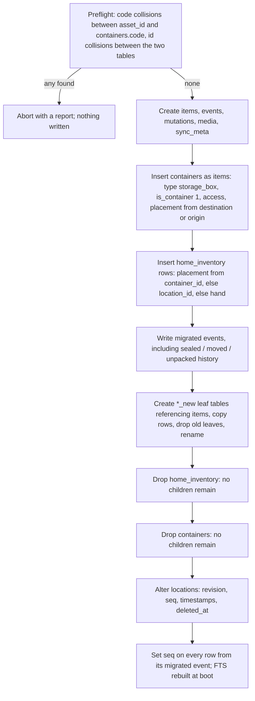
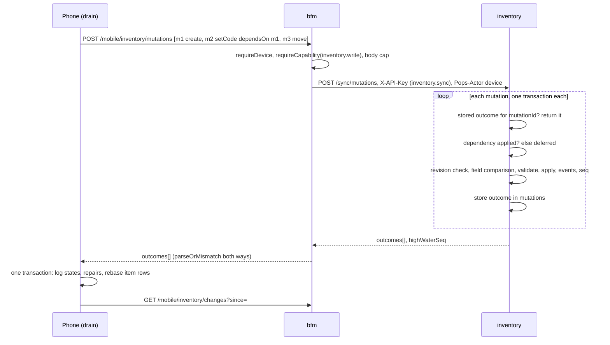
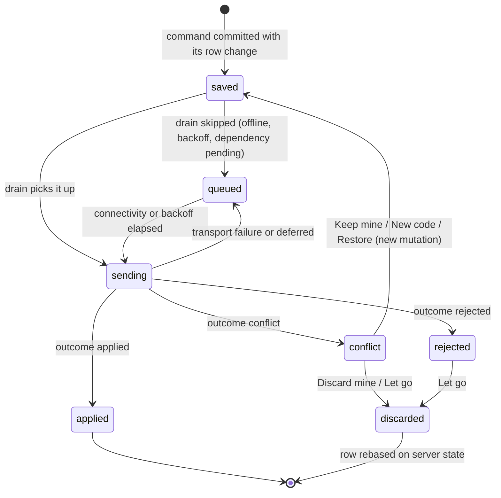
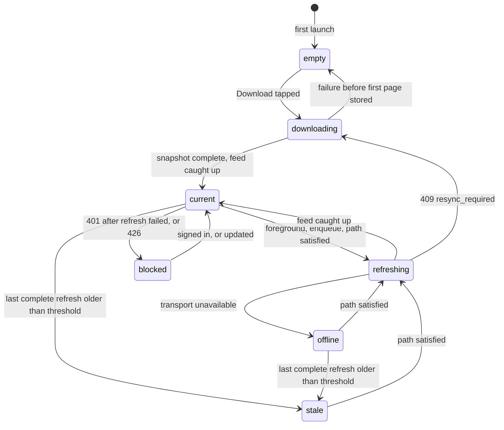

# Inventory ADR-002: One item identity, an event log, and a replicated catalogue on the phone

## Status

Accepted, 2026-09-18. The owner delegated these technical calls to this design, and implementation has started against it (Phase A slices are already landing). Technical design gate for the Inventory rebuild (POPS-3994). Builds on inventory [ADR-001](./adr-001-domain-vocabulary.md) (domain vocabulary) for every noun used here, on root [ADR-044](../../../../docs/architecture/adr-044-inbound-service-account-scope-enforcement.md) and [ADR-048](../../../../docs/architecture/adr-048-mobile-capability-scopes.md) for authorisation, and on [ADR-033](../../../../docs/architecture/adr-033-cross-language-pillar-contracts.md) for the Swift contract boundary. The bfm and iOS parts are recorded here rather than in a root ADR because every one of them exists to serve this pillar's protocol; a second consumer of the sync machinery would be the moment to lift them.

## Context

The product source of truth ("Inventory product and design source of truth", Huly, POPS Product Design) and ADR-001 settle what Inventory is. Every iOS screen family is approved (2026-09-18). What they deliberately leave open is the list this document answers: physical schema, migration from the separate container table, the revision and conflict protocol, offline code allocation, the phone's local database and media eviction, the mutation log and replay order, the bfm wire contract and its compatibility rules, search, authorisation and rollout.

What the code holds today (`origin/main`, 2026-09-18):

- `pillars/inventory` is Express 5 plus ts-rest over one SQLite file, Drizzle migrations applied at boot inside one transaction, behind `withPreMigrationBackup`. Tables: `home_inventory` (Notion-era columns, `asset_id` unique, `source_ref` unique, `container_id`), `locations` (self-referential, no FK on `parent_id`), `containers` (POPS-3581: `state` in `open|sealed|moved|unpacked`, origin and destination locations), and five leaf tables (`item_photos`, `item_uploaded_files`, `item_documents`, `item_connections`, `item_fixture_connections`) that cascade from `home_inventory`.
- No quantity, no lifecycle, no history, no revisions, no soft delete. Offset pagination on `/items`.
- No inbound credential check: ADR-044 names inventory as one of the producers that still serves any in-network caller. `purchases` already calls `items.create` and `items.get` with an `inventory.items` scope; the MCP server calls items, locations, connections and fixtures with the `pops_api_key` account, whose grant is not visible from the repo.
- bfm has no inventory route, capability or scope, and no mobile route that batches, carries a revision, or supports offline replay. The only idempotency precedent is the receipt draft's `idempotencyKey`, and content addressing for receipt bytes.
- The iOS app has no local persistence of any kind and no deep-link handling. The approved Inventory design lives entirely in `DesignPlayground` (about 16,000 lines across `Surfaces/Inventory` and `Components/Inventory`) with no `AppCore` domain types and no `FeatureInventory` package.
- Production holds zero items and zero locations (read through the MCP inventory tools on 2026-09-18). The migration below must still be correct on any database, but its live blast radius today is nil.
- The platform's soft-URI grammar is `pops://<pillar>/<type>/<id>` with a singular type (`libs/sdk/src/soft-uri.ts`), and `purchases` already stores `pops://inventory/item/<id>` in `purchase_item_units.inventory_item_uri`.

The move-out deadline is about 2026-10-12. The product says the phone must work offline after one synchronisation; the approved screens draw every sync and repair state.

## Decisions

Each decision lists what was rejected and what it costs. Where the direction handed to this design was wrong on the evidence, the decision says so and records what replaced it.

### D1. One identity: containers fold into items

| Option                                                            | Pros                                                                                                                            | Cons                                                                                                                                  |
| ----------------------------------------------------------------- | ------------------------------------------------------------------------------------------------------------------------------- | ------------------------------------------------------------------------------------------------------------------------------------- |
| **A container is an item whose type grants containment (chosen)** | One id, one QR, one lifecycle, one history, one placement column set; "box inside a box" is ordinary recursion; matches ADR-001 | Every item row carries container-only columns (`access`, `is_full`) that are null for most rows                                       |
| Keep `containers` and add a `kind` bridge                         | No migration of the existing table                                                                                              | Two identities for one physical thing; every action (discard, photograph, label, move) implemented twice; ADR-001 already rejected it |
| Containment as a type field in `fields`                           | Nothing new on the row                                                                                                          | A capability changes which screens exist, which ADR-001 says a field must never do; the database could not constrain access state     |

**Decision.** `containers` is removed. A container is an `items` row with `is_container = 1`. `is_container` is not writable by a client: the server sets it from the item's type, whose code definition declares `capabilities: ['containment']`. An untyped item is never a container (ADR-001: a capability is something a type grants). Access state is `open | closed` on the row. `sealed`, `moved` and `unpacked` are not states: they become history events (D4). Fullness is `is_full`, a manual yes/no owned by the containment capability rather than by any type's field list, because the approved container page shows it for every container and furniture types would otherwise each redeclare it.

**Consequences.** A type change that would remove containment from an item that still holds active contents is rejected (`has_contents`). The playground's `InventoryAccess.sealed` case has no backend counterpart and is dropped when the vocabulary moves into `AppCore`. Migrated boxes need a type: they receive `storage_box` (the playground's "Storage box" template), which is the only way an existing box stays a container under this rule.

### D2. Placement is one of three, stored explicitly, with one remembered previous placement

| Option                                                                              | Pros                                                                                                | Cons                                                                                                                  |
| ----------------------------------------------------------------------------------- | --------------------------------------------------------------------------------------------------- | --------------------------------------------------------------------------------------------------------------------- |
| **`placement_kind` plus the matching reference, enforced by CHECK (chosen)**        | Illegal combinations cannot be written; in hand is a state, not an absence; one row change per move | Three columns where one would do for a pure tree                                                                      |
| Nullable `location_id` and `containing_item_id`, meaning inferred from which is set | What the table has today                                                                            | "Both set" is today's actual state after `moveContainer`, and "neither set" cannot distinguish in hand from forgotten |
| A separate `placements` history table as source of truth                            | History for free                                                                                    | Every read becomes "latest row per item"; the event log (D4) already records history                                  |

**Decision.** `placement_kind in ('location','container','hand')`. `location` requires `location_id` and forbids `containing_item_id`; `container` the reverse; `hand` forbids both. In hand remembers `previous_placement_kind` plus one of `previous_location_id` / `previous_containing_item_id`, with no foreign key, because "Previous place deleted" is an approved state and the reference must survive the target's tombstone. Effective location is derived by walking `containing_item_id` upward (a recursive CTE server-side, the same walk on the phone) and is never stored, so moving a container writes one row: its contents are contained, not relocated, and their revisions do not move. That is what keeps a box move from raising a conflict on every item inside it.

Containment cycles are rejected: before a move into container `C`, the server walks `C`'s ancestors and refuses (`cycle`) if the moving item is among them, or if the chain exceeds 32 levels. A container may not contain itself (CHECK).

Deleting a location (the approved "Deleting a place with things in it" state) is a tombstone plus reparenting: child places and direct items move to the parent place; at a root they go in hand with the deleted place as their previous placement, which is exactly what produces the approved "Previous place deleted" row.

**Consequences.** Every query that shows "where" joins through the walk. The data is thousands of rows, not millions, so the CTE is cheap; if it ever is not, an `effective_location_id` cache can be added without changing the protocol, because it would not be revisioned.

### D3. Lifecycle and quantity are columns; the reason lives on the event

**Decision.** `lifecycle in ('active','retired','discarded','lost','destroyed')`, independent of placement. The reason (donated, sold, used up, broken, gave away) is stored only on the lifecycle event, per POPS-3989. `destroyed` is terminal: `restore` from it is rejected (`illegal_transition`), matching `InventoryLifecycle.isRestorable`. An inactive item keeps its placement for history, and is excluded from contents lists, counts and search unless "Include inactive" is on.

Quantity is an integer on the row, `CHECK (quantity >= 1)`. `split` creates a new item with a client-minted id, the split-off count and the same placement, type, fields, note and photo references; the code is not copied (a code is one sticker). There is no partial discard: a group is discarded whole, split first, or renumbered.

| Option                                             | Pros                                                                                              | Cons                                                                                                                                                                 |
| -------------------------------------------------- | ------------------------------------------------------------------------------------------------- | -------------------------------------------------------------------------------------------------------------------------------------------------------------------- |
| **Lifecycle column, reason on the event (chosen)** | Badge is the lifecycle word; filters are a column predicate; reason cannot drift from its history | Reason is not queryable without reading events                                                                                                                       |
| Lifecycle as a derived value over events           | One source of truth                                                                               | Every list and count replays events                                                                                                                                  |
| `quantity >= 0`, keeping "none left" rows          | The playground's `InventoryQuantity.badge` and filter draw "None left"                            | No approved action produces zero (Change quantity is `1...9999`, Split leaves at least one, discard is whole); a zero row is a used-up item wearing the active badge |

**Consequences.** The playground's "None left" badge and "None left" quantity filter can never match a real row. That is a product-visible gap and is listed under open questions rather than silently settled.

### D4. History is an append-only event log, and its sequence is the sync sequence

| Option                                                                             | Pros                                                                                                                                                                                                    | Cons                                                                         |
| ---------------------------------------------------------------------------------- | ------------------------------------------------------------------------------------------------------------------------------------------------------------------------------------------------------- | ---------------------------------------------------------------------------- |
| **One `events` table; `seq` autoincrement is the global change sequence (chosen)** | History, change feed and conflict detection share one ordered record; undo is an ordinary event; SQLite serialises writers, so a committed `seq` N implies every `seq` below N is committed and visible | Every write path must go through the command layer (D6) or history has holes |
| Per-table `updated_at` for the feed, separate history table                        | Familiar                                                                                                                                                                                                | Clocks are not authority (product decision); two records to keep in step     |
| Trigger-written audit rows                                                         | Cannot be bypassed                                                                                                                                                                                      | Triggers cannot know the actor, the mutation id or the reason                |

**Decision.** `events.seq INTEGER PRIMARY KEY AUTOINCREMENT` is the server change sequence. Each event records the entity, the event kind, the fields it touched with before and after values, the reason, the entity revision after it, the actor (`device` with bfm's device id and label, `web`, `service` with the account name, or `migration`), the mutation id, and `compensates_seq` for an undo. Every revisioned row carries `seq` = the `seq` of the last event that changed it. Triggers make `events` append-only (`BEFORE UPDATE` and `BEFORE DELETE` raise).

Undo is a compensating event. `event.revert` inverts one event's field changes; it conflicts if any of those fields changed since. The phone's Undo capsule cancels the mutation if it has not left the device, and sends `event.revert` if it has.

**Consequences.** The log grows forever; at one household's volume that is megabytes. A database restored from backup rewinds `seq`; D10 handles that with an epoch.

### D5. Types are code on the server and a served catalogue on the phone

The direction asked for zod templates on the server and "a mirrored Swift definition generated or hand-kept". That is overturned.

| Option                                                                                               | Pros                                                                                                                                                                | Cons                                                                                                                                                                                       |
| ---------------------------------------------------------------------------------------------------- | ------------------------------------------------------------------------------------------------------------------------------------------------------------------- | ------------------------------------------------------------------------------------------------------------------------------------------------------------------------------------------ |
| Hand-kept Swift mirror                                                                               | No build tooling                                                                                                                                                    | Drift is certain and silent; a new type needs an App Store release before the phone can file one                                                                                           |
| Swift generated from the TypeScript definitions at build time                                        | No hand drift                                                                                                                                                       | Still couples type availability to app releases; the server can accept a type an installed app cannot render; a third codegen fan-out on a lane that costs about 35 minutes per CI attempt |
| **Types defined in TypeScript, projected to a versioned JSON descriptor served to clients (chosen)** | One definition; a server deploy ships a type to every installed phone at the next sync; the phone renders any type generically because value kinds are a closed set | Value kinds, units and capabilities become protocol vocabulary that the app must know                                                                                                      |

**Decision.** `pillars/inventory/src/types/` holds `defineType({ key, name, capabilities, fields })`. A field declares `key`, `label`, `kind` (`text | choice | flag | measurement | range | link`), `dimension` and default `unit` for measurements and ranges, `choices` for a choice, `highlighted`, and `required`. The zod validator for an item's `fields` blob is derived from its type. Values are stored as the kind requires; a measurement is `{ value, unit }` and keeps the unit it was typed in (POPS-4015); `units.ts` declares each unit's dimension and multiplier so search and comparison convert. `GET /types` serves the catalogue descriptor (types plus the unit table) with `version` = a hash of its serialisation.

This is still "types are code, shipped by deploy" (ADR-001): nothing authors a type at runtime and nothing stores a type definition in a database row. The descriptor is a projection, like the OpenAPI file.

Drift is prevented in two places. A committed `types.snapshot.json` is compared in a test; a change that removes a choice, changes a dimension or removes a field fails unless it ships a registered data migration that rewrites affected values (and records `migration` events), which is the product rule "choice-list and unit changes are migrations". The value-kind, dimension and capability vocabularies are enums in the bfm contract, so the Swift generator gives the app exactly the set it understands; adding one raises the protocol minimum (D10), which the phone meets with the approved "This app is too old" interruption.

**Consequences.** The phone validates offline against the catalogue it last downloaded; a value it accepted can be refused by a server whose catalogue has moved on, which surfaces as a `rejected` outcome (see open questions). The "type arrived" sheet (POPS-4016) triggers on a catalogue version change that adds a type; its "covers waiting items" match uses each type's optional `legacyLabels`, compared with the migrated `legacy_type` text.

### D6. Every write is a command; the command layer is the only writer

**Decision.** `pillars/inventory/src/domain/commands/` implements every mutation as a command: validate, check revision (D8), apply, write events, bump revision and `seq`, maintain the search index, all in one transaction. The sync endpoint, the rewritten legacy REST routes (`POST /items` for purchases, `GET/PATCH /items/:id`, location CRUD for MCP and the web) and the web's future edits all call it. The `/containers*` routes are deleted: their only consumer is the web app's generated client, with no page using it.

Clients mint ids (UUIDv4, validated) for items, locations and mutations. An offline create therefore has its final id from the first keystroke (the playground's `InventoryDraft.internalID` already assumes this), no id mapping exists anywhere, and a label printed later from web encodes the same id the phone created.

**Consequences.** Hard deletion leaves the everyday path. Delete becomes a tombstone (`deleted_at`) that `item.restoreDeleted` reverses, which is what makes the approved "Deleted on iPad, Restore" repair possible. A purge of tombstones is an operator action, not built here.

### D7. Codes are optional, unique when present, and never changed by the server

**Decision.** `items.code` is nullable (ADR-001: most items carry none) with a unique index on `code COLLATE NOCASE`. The migration moves `home_inventory.asset_id` and `containers.code` into it. A code is set by its own mutation, `item.setCode`, never inside a create: a phone that created an item and gave it a code offline sends `item.create` and a dependent `item.setCode`, so a collision leaves the item created and raises only the code repair. On collision the outcome is `conflict` of kind `code_collision` carrying the holder's name and a suggestion (the next free code keeping the stem, `B412` to `B413`). The server never assigns or rewrites a code on its own, because the label may already be printed.

`POST /codes/suggest` returns suggestions online: deterministic stem plus next free number in Phase A, an AI ranking behind the same route in Phase C. Offline, the approved `.offline` assist state applies and a typed code is checked against the local replica only.

### D8. Revisions and conflicts are per row, resolved per field against the event log

| Option                                                                                             | Pros                                                                                                             | Cons                                                                                                                                           |
| -------------------------------------------------------------------------------------------------- | ---------------------------------------------------------------------------------------------------------------- | ---------------------------------------------------------------------------------------------------------------------------------------------- |
| Row-level optimistic concurrency, any mismatch is a conflict                                       | Simplest                                                                                                         | Renaming a box on the iPad would conflict with packing into it on the phone; the approved fixtures show auto-resolution ("Same count on both") |
| Last writer wins by device clock                                                                   | No repair UI                                                                                                     | Clocks drift; the product forbids it                                                                                                           |
| CRDTs per field                                                                                    | Automatic merges                                                                                                 | Placement and lifecycle are not mergeable values; a merged "moved to two places" is wrong                                                      |
| **Row revision checked, then field-level comparison over events since the base revision (chosen)** | Conflicts only where two sources changed the same field to different values; convergent edits resolve themselves | The server reads the item's events since `baseRevision` on every stale write                                                                   |

**Decision.** `items.revision` and `locations.revision` increment on every change. Every mutation carries `baseRevision` (null for a create). On mismatch the server collects the fields changed by events after `baseRevision`. If none overlap the mutation's fields, it applies. If they overlap and the resulting value equals the current value, it applies with `converged: true` (the approved "Same count on both" resolved entry). Otherwise it returns `conflict` of kind `field` with the field, this mutation's value, the current value, and the source and time of the change that won (`source` from the event actor: a device label such as "iPad", or "Server" for web and services). Placement counts as one field, so the approved "Moved on iPad too" is exactly this case.

"Keep mine" re-sends the change with `baseRevision` set to the conflict's `currentRevision`. "Discard mine" drops the mutation and rebases the phone's view. Client times travel as `clientTime` and are stored on events as audit evidence only.

### D9. The sync protocol: snapshot, change feed, batched idempotent mutations, content-addressed media

**Decision.** Inventory owns the protocol (`pillars/inventory/src/contract/rest-sync.ts`, sub-routers `sync` (snapshot, changes, mutations, item history), `media`, `types`, `codes`). bfm exposes it under `/mobile/inventory/*` with the capability gate, body caps and the device as actor. bfm validates both directions with `parseOrMismatch` and maps field names to the mobile contract; it adds no semantics, because revision checks and outcomes must be decided by the producer that enforces them.

- **Snapshot**: pages of items, locations and photo references at a high-water `seq` S fixed by the first page. Rows changed while paging may arrive newer than S; that is safe because the phone upserts by revision and then reads the feed from S.
- **Change feed**: every row with `seq > since`, tombstones included, ordered by `seq`, plus events after `since` so recent history is readable offline. Older history is fetched per item on demand.
- **Mutations**: up to 50 per request, each with `mutationId`, `op`, `entityId`, `baseRevision`, `dependsOn`, `clientTime`. Each is processed in its own transaction, in array order, and its outcome is stored in `mutations` in the same transaction, so a retried batch replays stored outcomes and never applies twice. A mutation whose dependency is unknown to the server or did not apply returns `deferred` and stays queued.
- **Media**: `PUT /media/:sha256` with the bytes; the server verifies the hash, stores `sha256[0:2]/sha256` under the images volume, and derives 256 px and 1024 px variants with `sharp`. Re-sending is naturally idempotent (the receipt-bytes precedent). `item.attachPhoto` references the hash and depends on nothing server-side; if the bytes are absent the outcome is `rejected: media_missing`, which the phone treats as "upload first, then retry".

Outcomes map one to one to the phone's states, with one addition the direction lacked: `deferred`, which is "Waiting to sync". `rejected` has no approved repair screen; see open questions.

### D10. Versioning and recovery

**Decision.** Every `/mobile/inventory/*` request carries `Pops-Inventory-Protocol: <n>`. The server answers `426 client_too_old` below its minimum, which the phone shows as the approved blocking "This app is too old". Additive fields do not bump the protocol. Server-to-client values that may grow (lifecycle, event kind, discard reason, repair kind) are declared as strings on the wire and decoded into Swift enums with an `.unrecognised(String)` case, as `PurchaseSettlement` does, because POPS-1663 and POPS-1992 both broke installed apps with a closed enum.

`sync_meta.epoch` is a random id served with every snapshot and feed page. A `since` above the server's maximum `seq`, or an epoch the phone does not know, yields `409 resync_required`: the phone takes a fresh snapshot and keeps its mutation log, whose client-minted ids and base revisions make replay safe. The restore runbook rotates the epoch.

### D11. The phone keeps a GRDB replica and a durable, ordered mutation log

| Option                          | Pros                                                                                                                                                          | Cons                                                                                                                                                                          |
| ------------------------------- | ------------------------------------------------------------------------------------------------------------------------------------------------------------- | ----------------------------------------------------------------------------------------------------------------------------------------------------------------------------- |
| SwiftData                       | Native; no dependency                                                                                                                                         | No FTS5; migrations are implicit and hard to test; transaction boundaries across the replica and the log are not explicit; `@Model` classes leak persistence into view models |
| Plain SQLite C API              | No dependency                                                                                                                                                 | Hand-written binding, migration and observation code of the size GRDB already is                                                                                              |
| **GRDB, exact-pinned (chosen)** | Explicit transactions, `DatabaseMigrator`, FTS5, `ValueObservation` for SwiftUI, runs under `swift test` on the macOS host that `mise run test:packages` uses | A new external dependency on the `ModuleBoundaryTests` allowlist                                                                                                              |

**Decision.** A new implementation package `Packages/InventoryReplica` (AppCore plus GRDB) implements the `AppCore` `InventoryStore` protocol. It is added to `ModuleBoundaryTests.implementationPackages` and GRDB to `allowedExternalPackages` with an `exact:` pin. It performs no HTTP: it talks to an `InventorySyncTransport` protocol in `AppCore`, which `BFMClient` implements, so "exactly one package performs HTTP" still holds.

- **Durability before success.** A command commits the optimistic row change and its log entry in one GRDB transaction before the view reports success. The database runs WAL with `synchronous = FULL`; WAL's default `NORMAL` can lose the last transaction on power loss, which would break "restart must not lose staged work".
- **Data protection.** Database and media files use `FileProtectionType.completeUntilFirstUserAuthentication` so background refresh works after first unlock. The media cache directory is excluded from backup; the database is not, because it holds unsynced work.
- **Two row layers.** `item_base` is the last server state (with revision and `seq`); `item` is the optimistic view. A feed page updates `item_base`, then rebases each affected row by replaying its pending mutations over the new base. Commands are applied locally by a Swift reducer whose behaviour is pinned to the server's by shared test vectors (`pillars/inventory/contracts/command-vectors-v1.json`, generated by the TypeScript command tests and vendored to `clients/ios/Contracts`, with the same drift guard as the refresh-message vector).
- **Replay order.** Stable topological order: enqueue order, corrected so nothing precedes its dependency, as the playground's `InventoryQueue.ordered` already specifies. The drain sends batches of up to 50, holds dependents back after a failure of their dependency, and backs off exponentially from 2 s to 5 min. It runs on foreground, after each enqueue, and on an `NWPathMonitor` change to satisfied.
- **Migrations.** `DatabaseMigrator` with append-only named migrations; a replica migration that cannot run falls back to re-snapshot while preserving the log table.
- **Media budget.** Thumbnails for every item are kept; full-size images live in an LRU cache capped at 500 MB; photos staged on this phone are pinned until the server acknowledges them. Free space under 200 MB before staging a photo, or `SQLITE_FULL`, raises the approved "Storage full" alert.
- **Search offline and online.** The phone searches its replica (FTS5 plus the approved ranking: name prefix, then name contains, then any other field), online as well as offline, once Phase B lands. This overturns "server search for the phone's online path": the whole catalogue is on the device, and two rankers would reorder results whenever connectivity changed. Server search remains for web and MCP.

### D12. Authorisation

**Decision.** Inventory adopts ADR-044 through `@pops/pillar-express` with root scope `inventory` and a scope map from `inventoryContract`, `requireCredential: false` (browser traffic through the shell stays ungated, as for finance and purchases). bfm's account gains `inventory.sync`, `inventory.media`, `inventory.types` and `inventory.codes`; purchases keeps `inventory.items`. The MCP account's registry grant must include `inventory` before the gate ships, or its inventory tools start answering 403, which is what POPS-1878 did to purchases.

Two mobile capabilities join `MOBILE_CAPABILITIES` and the default grant: `inventory.read` (snapshot, feed, types, media reads, item history) and `inventory.write` (mutations, media upload, code suggestion). Destroy is a lifecycle value, not a deletion, and location delete is a restorable tombstone that reparents contents, so neither is "destructive" in ADR-048's sense; hard deletion of items remains web-only. bfm passes the device as actor in `Pops-Actor: device:<deviceId>;label=<name>`; inventory honours that header only from a caller whose verified account holds `inventory.sync`, and records `web` or `service:<account>` otherwise.

### D13. QR codes encode the singular soft URI, and routing belongs to the app shell

The direction's `pops://inventory/items/<id>` is overturned: the platform grammar is `pops://<pillar>/<type>/<id>` with a singular type, `libs/sdk/src/soft-uri.ts` parses exactly that, and `purchases` already stores `pops://inventory/item/<id>`. The playground's `containers/<id>` path is dropped as well: a container is an item (D1), and a label must not stop resolving because its item's type changed.

**Decision.** Labels encode `pops://inventory/item/<id>` and `pops://inventory/location/<id>`. `AppCore/Navigation/PopsURI.swift` mirrors `parseSoftUri`; an `EntityRouter` in the composition root maps `(pillar, type)` to a feature's handler, FeatureInventory registers `inventory/item` and `inventory/location`, and any other well-formed URI becomes the approved one-line hand-off (`unsupported(pillar:)`). Lookup reads the replica, so scanning works offline. The same router serves `onOpenURL` for a `pops` URL scheme, so the system camera opens the same destinations.

### D14. Sequencing

**Decision.** Four shippable phases. Phase A is revised: instead of online reads through per-screen endpoints, Phase A already uses the sync protocol with an in-memory GRDB replica, and writes wait for the server's outcome. Phase B then changes the replica's storage and adds the log, the drain and repairs, without touching a screen or a route. Per-screen read endpoints would have been built for A and thrown away in B.

- **A. Online vertical slice**: schema and migration, command layer, sync routes, ADR-044 gate, bfm routes, `AppCore` types, `InventoryReplica` in memory, `FeatureInventory` screens. Usable on the phone with a connection.
- **B. Offline**: replica on disk, mutation log, drain, repairs, Sync and repair screens, offline photo staging.
- **C. Scanner, QR routing, labels, media budget, AI code suggestion.**
- **D. Web surfaces, server search for web, legacy column contraction, MCP tools.**

**Consequences.** Phase A alone does not meet the product's offline rule: an offline write in Phase A is refused with the shell's existing failed banner, which is not an approved Inventory state. Phase B must land before the first packing day, not merely before 2026-10-12.

## Data model (server)

All tables live in `inventory.db`. Types are SQLite affinities; JSON columns are `TEXT` with `json_valid` checks.

### `items` (replaces `home_inventory` and `containers`)

| Column                                                | Type                             | Rule                                                                                                                                                                                                                                                                                                                                                                                                                                                                                                                                    |
| ----------------------------------------------------- | -------------------------------- | --------------------------------------------------------------------------------------------------------------------------------------------------------------------------------------------------------------------------------------------------------------------------------------------------------------------------------------------------------------------------------------------------------------------------------------------------------------------------------------------------------------------------------------- |
| `id`                                                  | TEXT PK                          | UUID, client-mintable                                                                                                                                                                                                                                                                                                                                                                                                                                                                                                                   |
| `name`                                                | TEXT NOT NULL                    | from `item_name` / `containers.label`                                                                                                                                                                                                                                                                                                                                                                                                                                                                                                   |
| `type_key`                                            | TEXT NULL                        | a key in the catalogue; NULL is untyped                                                                                                                                                                                                                                                                                                                                                                                                                                                                                                 |
| `fields`                                              | TEXT NOT NULL DEFAULT `'{}'`     | JSON object, validated by the type's zod schema in the command layer                                                                                                                                                                                                                                                                                                                                                                                                                                                                    |
| `note`                                                | TEXT NULL                        | from `notes`                                                                                                                                                                                                                                                                                                                                                                                                                                                                                                                            |
| `code`                                                | TEXT NULL                        | unique `COLLATE NOCASE`; from `asset_id` / `containers.code`                                                                                                                                                                                                                                                                                                                                                                                                                                                                            |
| `external_ids`                                        | TEXT NOT NULL DEFAULT `'[]'`     | JSON `[{kind, value}]`; migrated `model` / `brand` stay columns (below)                                                                                                                                                                                                                                                                                                                                                                                                                                                                 |
| `quantity`                                            | INTEGER NOT NULL DEFAULT 1       | CHECK `>= 1`                                                                                                                                                                                                                                                                                                                                                                                                                                                                                                                            |
| `lifecycle`                                           | TEXT NOT NULL DEFAULT `'active'` | CHECK in five values                                                                                                                                                                                                                                                                                                                                                                                                                                                                                                                    |
| `lifecycle_changed_at`                                | TEXT NULL                        | server time of the last lifecycle event                                                                                                                                                                                                                                                                                                                                                                                                                                                                                                 |
| `placement_kind`                                      | TEXT NOT NULL                    | CHECK in `location`, `container`, `hand`                                                                                                                                                                                                                                                                                                                                                                                                                                                                                                |
| `location_id`                                         | TEXT NULL                        | FK `locations(id)`                                                                                                                                                                                                                                                                                                                                                                                                                                                                                                                      |
| `containing_item_id`                                  | TEXT NULL                        | FK `items(id)`; CHECK `<> id`                                                                                                                                                                                                                                                                                                                                                                                                                                                                                                           |
| `previous_placement_kind`                             | TEXT NULL                        | CHECK in `location`, `container`; only when `placement_kind = 'hand'`                                                                                                                                                                                                                                                                                                                                                                                                                                                                   |
| `previous_location_id`, `previous_containing_item_id` | TEXT NULL                        | no FK (target may be tombstoned)                                                                                                                                                                                                                                                                                                                                                                                                                                                                                                        |
| `is_container`                                        | INTEGER NOT NULL DEFAULT 0       | set from the type's capabilities, never by a client                                                                                                                                                                                                                                                                                                                                                                                                                                                                                     |
| `access`                                              | TEXT NULL                        | CHECK in `open`, `closed`; CHECK `(is_container = 1) = (access IS NOT NULL)`                                                                                                                                                                                                                                                                                                                                                                                                                                                            |
| `is_full`                                             | INTEGER NULL                     | CHECK `is_container = 1 OR is_full IS NULL`                                                                                                                                                                                                                                                                                                                                                                                                                                                                                             |
| `legacy_type`                                         | TEXT NULL                        | the old free-text `type`, read-only, feeds the type-arrived match                                                                                                                                                                                                                                                                                                                                                                                                                                                                       |
| provenance and value columns                          | as today                         | `purchase_transaction_id`, `purchase_transaction_uri`, `purchase_transaction_stale_at`, `purchased_from_id`, `purchased_from_name`, `purchase_price`, `purchase_date`, `warranty_expires`, `replacement_value`, `resale_value`, `source_ref` (unique), `brand`, `model`, `condition`, `in_use`, `deductible`, `notion_id`, `owner_uri`, `owner_stale_at`, `room`, `location_text` (was `location`), `item_id`, `last_edited_time`: carried unchanged; their removal is Phase D's contraction migration, not this design's critical path |
| `revision`                                            | INTEGER NOT NULL DEFAULT 1       |                                                                                                                                                                                                                                                                                                                                                                                                                                                                                                                                         |
| `seq`                                                 | INTEGER NOT NULL                 | `seq` of the last event                                                                                                                                                                                                                                                                                                                                                                                                                                                                                                                 |
| `created_at`, `updated_at`                            | TEXT NOT NULL                    | server clock                                                                                                                                                                                                                                                                                                                                                                                                                                                                                                                            |
| `deleted_at`                                          | TEXT NULL                        | tombstone                                                                                                                                                                                                                                                                                                                                                                                                                                                                                                                               |

Placement CHECK: `(placement_kind = 'location' AND location_id IS NOT NULL AND containing_item_id IS NULL) OR (placement_kind = 'container' AND containing_item_id IS NOT NULL AND location_id IS NULL) OR (placement_kind = 'hand' AND location_id IS NULL AND containing_item_id IS NULL)`.

Indexes: `items_seq(seq)`, `items_location(location_id)`, `items_containing(containing_item_id)`, `items_type(type_key)`, `items_lifecycle(lifecycle)`, `items_name(name)`, partial `items_in_hand(id) WHERE placement_kind = 'hand'`, partial `items_containers(id) WHERE is_container = 1`, unique `items_code(code COLLATE NOCASE)`, unique `items_source_ref(source_ref)`, `items_purchase_uri(purchase_transaction_uri)`.

### `locations` (altered in place)

Adds `revision INTEGER NOT NULL DEFAULT 1`, `seq INTEGER NOT NULL DEFAULT 0`, `created_at`, `updated_at`, `deleted_at`. `parent_id` keeps its missing FK (rebuilding `locations` inside the migration's transaction would cascade into fixtures); the command layer rejects reparenting cycles, which `reparentTargets` in the playground already models. Index `locations_seq(seq)`.

### `events`

| Column                                  | Type                     | Rule                                                                                                                                                                                                                                                                                      |
| --------------------------------------- | ------------------------ | ----------------------------------------------------------------------------------------------------------------------------------------------------------------------------------------------------------------------------------------------------------------------------------------- |
| `seq`                                   | INTEGER PK AUTOINCREMENT | global change sequence                                                                                                                                                                                                                                                                    |
| `entity_kind`                           | TEXT NOT NULL            | `item`, `location`                                                                                                                                                                                                                                                                        |
| `entity_id`                             | TEXT NOT NULL            |                                                                                                                                                                                                                                                                                           |
| `kind`                                  | TEXT NOT NULL            | `created`, `edited`, `type_changed`, `code_set`, `moved`, `picked_up`, `put_back`, `stored`, `opened`, `closed`, `sealed`, `unpacked`, `lifecycle_changed`, `quantity_changed`, `split_from`, `split_into`, `photo_added`, `photo_removed`, `deleted`, `restored`, `reverted`, `migrated` |
| `fields`                                | TEXT NOT NULL            | JSON array of field names touched                                                                                                                                                                                                                                                         |
| `before`, `after`                       | TEXT NOT NULL            | JSON objects keyed by those fields                                                                                                                                                                                                                                                        |
| `reason`                                | TEXT NULL                | discard reason                                                                                                                                                                                                                                                                            |
| `entity_revision`                       | INTEGER NOT NULL         | revision after the event                                                                                                                                                                                                                                                                  |
| `actor_kind`, `actor_id`, `actor_label` | TEXT                     | `device` / `web` / `service` / `migration`                                                                                                                                                                                                                                                |
| `mutation_id`                           | TEXT NULL                |                                                                                                                                                                                                                                                                                           |
| `compensates_seq`                       | INTEGER NULL             | FK `events(seq)`                                                                                                                                                                                                                                                                          |
| `client_time`                           | TEXT NULL                | audit only                                                                                                                                                                                                                                                                                |
| `server_time`                           | TEXT NOT NULL            |                                                                                                                                                                                                                                                                                           |

Index `events_entity(entity_kind, entity_id, seq)`. Triggers `events_no_update`, `events_no_delete` raise `ABORT`.

### `mutations`

`mutation_id TEXT PK`, `actor_id TEXT NOT NULL`, `op TEXT NOT NULL`, `status TEXT NOT NULL` (`applied | conflict | rejected`; `deferred` is never stored, so a retry re-evaluates), `outcome TEXT NOT NULL` (JSON), `received_at TEXT NOT NULL`. Index `mutations_actor(actor_id, received_at)`.

### `media` and `item_photos`

`media`: `sha256 TEXT PK CHECK (length(sha256) = 64)`, `mime TEXT`, `byte_size INTEGER`, `width INTEGER`, `height INTEGER`, `stored_at TEXT`. `item_photos` is rebuilt: `id INTEGER PK`, `item_id` FK `items(id)` cascade, `media_sha256` FK `media(sha256)` NULL, `file_path` NULL (legacy rows until the hash backfill runs), `caption`, `position`, `created_at`. Photo changes are item events and bump the item's revision, so the feed ships each item with its ordered photo hashes.

### `sync_meta`

Key/value: `epoch`, `min_protocol`, `catalogue_version`.

### `items_fts`

FTS5 over `name`, `code`, `note`, `type_label`, `field_text`, `external_ids`, maintained by the command layer (not triggers, because the type label comes from code). Rebuilt at boot when `catalogue_version` changes.

`item_uploaded_files`, `item_documents`, `item_connections` and `item_fixture_connections` keep their shapes and are rebuilt only to point at `items`. `fixtures` is untouched; ADR-001's "a fixture is an item with the wired-in capability" is not part of this design.

## Migration

Migration `0012_items_single_identity.sql`, applied by Drizzle at boot inside its single transaction, after `withPreMigrationBackup`. The obvious rebuild recipe (`PRAGMA foreign_keys = OFF`, rebuild, re-enable) is unavailable because that pragma is a no-op inside a transaction, and `DROP TABLE home_inventory` with foreign keys on would perform an implicit `DELETE` that cascades into all five leaf tables. The order below never drops a table that still has children.



Row mapping:

- **Ids**: kept verbatim. Container ids become item ids, so every `home_inventory.container_id` is already a valid `containing_item_id`. Both tables mint UUIDs, so a collision is not expected; the preflight turns one into an abort rather than a merge. The preflight is expressed in SQL as an `INSERT` into a one-row table with a `CHECK (0)` guarded by `WHERE EXISTS (collision)`, which aborts the transaction with a named constraint.
- **Codes**: `asset_id` and `containers.code` merge into one namespace; a case-insensitive clash aborts the same way. The server may not rename a printed code, so the operator resolves it by hand and reboots.
- **Container state**: `open` and `unpacked` become `access = 'open'`; `sealed` and `moved` become `closed`. Each non-`open` state also writes one `migrated` history event of kind `sealed`, `moved` (from origin to destination) or `unpacked`, stamped with `containers.updated_at`, actor `migration`.
- **Container placement**: `destination_location_id ?? origin_location_id` as `location`; neither gives `hand` with no previous placement.
- **Contained items**: `container_id` set gives `placement_kind = 'container'` and clears `location_id`. When the old `location_id` disagreed with the container's location (the state `moveContainer` could leave), the event records the discarded value in `before`.
- **Other items**: `location_id` set gives `location`; otherwise `hand`, previous placement null (the approved "Nowhere recorded").
- **Type and fields**: `type_key` NULL (untyped), `fields = '{}'`, old free-text `type` into `legacy_type`.
- **Revision and history**: every migrated row gets revision 1 and one `created` event with actor `migration`.

**Running it without an outage anyone would notice.** Inventory is one process over one SQLite file; there is no zero-downtime path in the strict sense and none is needed. The migration runs at container start, before the listener binds; the gateway answers 502 for the few seconds that takes, and the phone and web treat that as the existing `unavailable` state. On today's empty production database it is milliseconds. The pre-migration backup is the rollback: a failed migration leaves the transaction unapplied and the old image can be redeployed against the untouched file.

A data-only follow-up at boot (idempotent, outside SQL because it reads files) hashes any legacy `item_photos.file_path` into `media`.

Contract phase (Phase D): a later migration drops the Notion-era columns listed above once the web app and MCP no longer read them.

## Wire contract (`/mobile/inventory/*`, bfm)

Every route: `requireDevice`, then `requireCapability`, the mobile rate limit, header `Pops-Inventory-Protocol: 1`. Every route declares `MOBILE_REQUEST_RESPONSES`, `MOBILE_PERIMETER_RESPONSES`, `MOBILE_UPSTREAM_RESPONSES` and `426 client_too_old`. Cursors are opaque base64url that the app echoes unmodified; a foreign cursor is `400 invalid_cursor`.

| Route                                    | Capability        | Request                                              | Response                                                                                                     |
| ---------------------------------------- | ----------------- | ---------------------------------------------------- | ------------------------------------------------------------------------------------------------------------ |
| `GET /mobile/inventory/types`            | `inventory.read`  | `If-None-Match`                                      | `200 { version, units[], types[] }` or `304`                                                                 |
| `GET /mobile/inventory/snapshot`         | `inventory.read`  | `cursor?`, `limit` 1..500 (default 250)              | `200 { epoch, highWaterSeq, catalogueVersion, total, items[], locations[], nextCursor }`                     |
| `GET /mobile/inventory/changes`          | `inventory.read`  | `since` (seq), `epoch`, `limit` 1..500               | `200 { epoch, items[], locations[], events[], nextSince, hasMore, catalogueVersion }`; `409 resync_required` |
| `GET /mobile/inventory/items/:id/events` | `inventory.read`  | `cursor?`, `limit`                                   | `200 { events[], nextCursor }`; `404`                                                                        |
| `POST /mobile/inventory/mutations`       | `inventory.write` | `{ mutations: Mutation[] }` (1..50, body cap 256 KB) | `200 { outcomes: Outcome[], highWaterSeq }`; `413`                                                           |
| `PUT /mobile/inventory/media/:sha256`    | `inventory.write` | `image/jpeg` or `image/heic` bytes, cap 8 MB         | `201 { sha256 }` or `200 { sha256, alreadyStored: true }`; `400 hash_mismatch`; `413`; `415`                 |
| `GET /mobile/inventory/media/:sha256`    | `inventory.read`  | `variant = thumb                                     | medium                                                                                                       | full` | bytes, `ETag: <sha256>-<variant>`; `404` |
| `POST /mobile/inventory/codes/suggest`   | `inventory.write` | `{ name, typeKey?, stem? }`                          | `200 { suggestions: string[] }`; `503` maps to the approved `.unavailable`                                   |

Shapes (camelCase on the wire; `?` is optional):

```text
Item      { id, revision, seq, name, typeKey?, fields{}, note?, code?, externalIds[{kind,value}],
            quantity, lifecycle, lifecycleChangedAt?, placement, previousPlacement?,
            isContainer, access?, isFull?, photos[{sha256, caption?}],
            provenance?{merchant?, price?, purchasedOn?, warrantyExpires?, transactionUri?},
            documentsStatus: 'linked'|'none'|'unavailable', documentTitles[],
            createdAt, updatedAt, deletedAt? }
Placement { kind: 'location', locationId } | { kind: 'container', itemId } | { kind: 'hand' }
Location  { id, revision, seq, name, parentId?, sortOrder, deletedAt? }
Event     { seq, entityKind, entityId, kind, fields[], before{}, after{}, reason?,
            actor{kind, label}, clientTime?, serverTime, compensatesSeq?, undoable }
Mutation  { mutationId, op, entityId, baseRevision?, dependsOn[], clientTime, args }
Outcome   { mutationId, status: 'applied', revision, seq, converged }
        | { mutationId, status: 'conflict', kind: 'field', field, mine, theirs,
            source{kind,label}, at, currentRevision }
        | { mutationId, status: 'conflict', kind: 'code_collision', heldBy{id,name}, suggestedCode }
        | { mutationId, status: 'conflict', kind: 'deleted', source{kind,label}, at }
        | { mutationId, status: 'rejected', reason, message }
        | { mutationId, status: 'deferred', waitingOn }
```

`documentsStatus` is resolved when a snapshot or feed page is built; `unavailable` is the approved "Paperless unavailable" state and is recomputed on every refresh rather than cached as truth.

Ops and their `args`: `item.create { item }`, `item.edit { name?, note?, fields? (per-key patch), externalIds? }`, `item.changeType { typeKey, fields }`, `item.setCode { code | null }`, `item.move { to: Placement, verb: 'move'|'pick_up'|'put_back'|'store' }`, `item.setAccess { access }`, `item.setFull { full }`, `item.setLifecycle { lifecycle, reason? }`, `item.setQuantity { quantity }`, `item.split { newItemId, quantity }`, `item.attachPhoto { sha256, position }`, `item.removePhoto { sha256 }`, `item.reorderPhotos { sha256s[] }`, `item.restoreDeleted {}`, `location.create { location }`, `location.rename { name }`, `location.move { parentId? }`, `location.delete {}`, `event.revert { seq }`.

`rejected` reasons (closed on the server, open string on the wire): `invalid`, `type_unknown`, `cycle`, `target_missing`, `not_container`, `has_contents`, `illegal_transition`, `media_missing`.

Idempotency: `mutationId` is the key, scoped globally (UUIDs). A replay returns the stored outcome. A replay whose `op` or `entityId` differs from the stored one is `rejected: invalid`, not a silent re-application.



## Sync state machine (phone)

Per mutation:



Per replica:



A row's `InventorySync` is derived, never stored: `needsAttention` if it has an open repair; else `synchronizing` if one of its mutations is in the in-flight batch; else `queued` if it has a pending mutation the drain has attempted or skipped; else `saved` if it has a pending mutation not yet attempted; else `stale` if the replica is stale; else `synchronized`.

## iOS replica design

Packages and seams:

- `AppCore/Inventory/`: domain types lifted from the playground (`InventoryPlacement`, `InventoryLifecycle`, `InventoryAccess` without `sealed`, `InventorySync`, `InventoryQuantity`, item, location, event, repair, catalogue descriptor), the `InventoryStore` protocol, and the `InventorySyncTransport` protocol. `AppCoreFakes` gains `InMemoryInventoryStore`.
- `InventoryReplica` (new implementation package, AppCore plus GRDB): schema, snapshot and feed apply, queries (effective location, direct and contained contents, in hand, open containers, recents, FTS search), the Swift command reducer, the mutation log, the drain, repairs, the media cache.
- `BFMClient`: `BFMInventoryTransport` over the generated client.
- `FeatureInventory` (AppCore plus DesignSystem only): the approved views moved from the playground, view models over `InventoryStore`. The playground re-points its Inventory surfaces at the real views through a playground-local `PlaygroundInventoryStore`, as Purchases does.

`InventoryStore` (sketch):

```swift
public protocol InventoryStore: Sendable {
    func observe<Value: Sendable>(_ query: InventoryQuery<Value>) -> AsyncStream<Value>
    func perform(_ command: InventoryCommand) async throws -> InventoryReceipt
    func undo(_ receipt: InventoryReceipt) async throws
    func resolve(_ repair: InventoryRepair.ID, with choice: InventoryRepairChoice) async throws
    func download() async throws
    func refresh() async
    func photo(_ sha256: String, variant: InventoryPhotoVariant) async throws -> Data
    func status() -> AsyncStream<InventoryReplicaStatus>
}
```

`perform` returns when the change is durable: in Phase A after the server's `applied` outcome, in Phase B after the local commit. Views never learn which.

Replica tables: `item_base`, `item`, `location_base`, `location`, `photo_ref`, `event` (feed and fetched history), `mutation_log (local_seq INTEGER PK AUTOINCREMENT, mutation_id UNIQUE, op, entity_id, args JSON, depends_on JSON, base_revision, state, outcome JSON, attempts, created_at, last_attempt_at)`, `repair (mutation_id PK, kind, payload JSON, opened_at, resolved_at, resolution)`, `resolved_entry`, `media (sha256 PK, variant, path, bytes, pinned, uploaded, last_access)`, `sync_meta (epoch, since, catalogue JSON, catalogue_version, last_refresh_at, snapshot_cursor)`, `item_fts`.

## Approved state to producing state

| Approved state (surface)                                                                              | Produced by                                                                                                          |
| ----------------------------------------------------------------------------------------------------- | -------------------------------------------------------------------------------------------------------------------- |
| First launch, "Nothing on this phone yet", Download (Search, Sync)                                    | Replica `empty`; Download calls `download()`                                                                         |
| First synchronization, "Synchronizing 62%" (Dashboard)                                                | Replica `downloading`; progress = rows stored / snapshot `total`                                                     |
| Loading skeletons (every browser, Sync, History, Location page)                                       | Query stream not yet emitted; History: per-item events fetch in flight                                               |
| Active packing, Settled home (Dashboard)                                                              | Queries: open containers (`is_container AND access = 'open' AND lifecycle = 'active'`), in hand, recent events       |
| One / several / no open containers (Dashboard, Open containers)                                       | Same query, count 1 / >1 / 0; survives relaunch because it is replica state                                          |
| Synced, silent row (all)                                                                              | Row derivation `synchronized`                                                                                        |
| Saved (row, silent)                                                                                   | Pending mutation not yet attempted                                                                                   |
| Waiting to sync, "Offline, six waiting" (row mark, Sync)                                              | Pending mutations in `queued`; list ordered by `InventoryQueue.ordered` over `local_seq` and `depends_on`            |
| Syncing with progress (Sync, Dashboard pill)                                                          | Mutations in the in-flight batch; progress from media upload bytes for photos                                        |
| Move waiting to sync (Location page)                                                                  | Pending `location.move` for that place                                                                               |
| Offline, synced N ago (Sync header, shell banner)                                                     | Replica `offline`; `last_refresh_at`                                                                                 |
| Offline and stale; stale marks in search (Dashboard, Search)                                          | Replica `stale` (threshold is an open question)                                                                      |
| Needs attention, count (Dashboard, Sync, row)                                                         | Open `repair` rows                                                                                                   |
| Conflict, placement "Moved on iPad too" (Repair)                                                      | Outcome `conflict/field` on `placement`, `source.label` from the winning event's actor                               |
| Conflict, field "Renamed on the server too" (Repair)                                                  | Outcome `conflict/field`, `source.kind` web or service, shown as "Server"                                            |
| "Moved elsewhere on another device" (Location page)                                                   | Outcome `conflict/field` on a location's `parentId`                                                                  |
| Code already used, "B412 is on Kitchen 09", New code B413 (Repair, form)                              | Outcome `conflict/code_collision` with `heldBy` and `suggestedCode`; offline, the form's local replica check         |
| Deleted on iPad, Restore / Let go (Repair)                                                            | Outcome `conflict/deleted`; Restore sends `item.restoreDeleted` then the original change                             |
| Photo not uploaded, Retry / Remove (Repair)                                                           | Media `PUT` answered `413`/`415`/`400`, or attempts exhausted; Remove drops the attach mutation and unpins the bytes |
| Kept, with Undo; Resolved list; "Same count on both" (Repair, Sync)                                   | `resolved_entry` rows; converged entries come from `applied` with `converged: true`                                  |
| Session expired (blocking)                                                                            | Refresh exchange failed (`401` after refresh, or device revoked)                                                     |
| Storage full (alert)                                                                                  | Free space under 200 MB before staging, or `SQLITE_FULL`                                                             |
| This app is too old (blocking)                                                                        | `426 client_too_old`                                                                                                 |
| In hand, one / several / empty (In hand, Dashboard)                                                   | `placement_kind = 'hand'` rows                                                                                       |
| From Office 04 / Nowhere recorded / Previous place deleted (In hand rows)                             | `previous_*` set and live / null / target tombstoned                                                                 |
| Just put back, with Undo                                                                              | `item.move {verb: put_back}` receipt; Undo cancels or reverts                                                        |
| Access open / closed chips, Open and Close actions                                                    | `access`                                                                                                             |
| Full group above Contents                                                                             | `is_full`                                                                                                            |
| Directly here vs Inside containers here (Location page)                                               | `location_id = X` vs contained rows whose walk reaches a container directly at X                                     |
| Deleting a place with things in it (confirmation text)                                                | Local count of children, direct containers and effective items; commit is `location.delete`                          |
| Discarded with reason, Lost, Retired, Destroyed (Item detail)                                         | `lifecycle` plus the latest `lifecycle_changed` event's `reason`                                                     |
| Just discarded / Restored, with Undo                                                                  | `item.setLifecycle` receipt; Undo cancels or reverts                                                                 |
| Destroy, confirming                                                                                   | Client confirmation; `restore` from destroyed is `rejected: illegal_transition`, so the menu hides it                |
| Split / Change quantity sheets                                                                        | `item.split`, `item.setQuantity`                                                                                     |
| Including inactive (Search filter)                                                                    | Query predicate on `lifecycle`                                                                                       |
| Filters: placement, container state, type, missing type/code/photo, sync (Search)                     | Local predicates; sync filter reads the derived row state                                                            |
| History long / short / event in full, Undo in the account (History)                                   | `event` rows; `undoable` = the event is the latest change to each of its fields and not destroyed                    |
| Code assist idle / suggesting / offered / accepted / rejected / edited (form)                         | Client state over `codes/suggest`                                                                                    |
| Code assist offline / unavailable (form)                                                              | Replica `offline` / suggest `503`                                                                                    |
| Documents linked / none / Paperless unavailable (Item detail)                                         | `documentsStatus`                                                                                                    |
| Photo hero, broken photo                                                                              | `photos[]`; broken when the media fetch fails and no cached variant exists                                           |
| Item detail conflict notice                                                                           | Open repair on the item                                                                                              |
| No type yet; Filtered to untyped (Items)                                                              | `type_key` NULL                                                                                                      |
| New type arrived sheet, once, Not now does not return                                                 | `catalogue_version` change adding a type whose `legacyLabels` match untyped rows; shown-once flag in `sync_meta`     |
| Scanning / resolving / found / other pillar / not a POPS code / target missing / camera denied (Scan) | `PopsURI` parse, `EntityRouter` dispatch, replica lookup (tombstoned or absent is target missing), `CameraAccess`    |
| Search empty, filter matches nothing                                                                  | Query result empty                                                                                                   |

## Consequences

- One write path (the command layer) means the web, MCP, purchases and the phone all produce history and revisions, and none can bypass conflict detection.
- The phone carries a second implementation of command semantics. The shared vectors make divergence a failing test, not a support question, but only for the cases the vectors cover.
- bfm gains its first batched, idempotent, revisioned route family. Its "mobile-shaped, not a proxy" rule bends here: the shape is the protocol's, deliberately, because the protocol's meaning is inventory's.
- The phone gains its first on-device database and its first third-party persistence dependency.
- A server deploy can ship a type; an app release is needed only for a new value kind, dimension or capability.
- Inventory's ADR-044 adoption can 403 the MCP account on the day it ships unless the operator widens that grant first.
- The images volume becomes the only copy of every photo; it is not covered by `infra/litestream/inventory.yml` and must join the offsite rclone set in homelab-infra before the move.
- Fixtures, connections and Paperless documents keep their current tables and routes; nothing here changes them beyond pointing their foreign keys at `items`.

## Open questions only the owner can answer

These are product-visible; the design picks a default for each so work is not blocked, and the default is named.

1. **A change the server refuses outright** (a containment cycle created on two devices, a target place deleted elsewhere, a value the catalogue stopped allowing after a deploy): no approved repair kind covers it. Default: shown as a repair with the item, the one-line reason and only "Let go".
2. **Discarding, losing or destroying a container that still holds things**: do the contents follow it, stay inside an inactive container, or block the action? Default: contents stay inside and remain active; the container's page shows them.
3. **"None left"**: the quantity badge and filter exist in the approved Search screens, but no approved action can produce a zero quantity. Default: remove the badge case and the filter option.
4. **When is the catalogue "stale"**, and does stale mark every row or only some? Default: stale after 24 hours without a complete refresh, marking every row in search results while stale.
5. **Phase A before Phase B**: until Phase B ships, an offline write is refused with the shell's failed banner, which is not an approved Inventory state. Default: accept it for the interval, and do not pack offline on Phase A.
